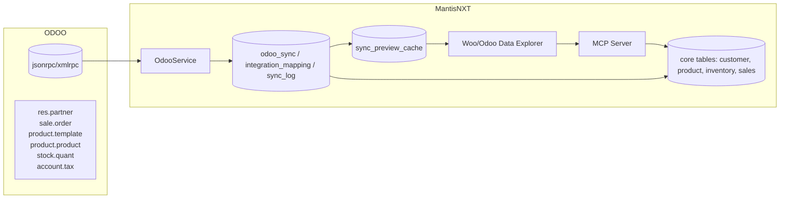

# ODOO Integration Context — MantisNXT

Version: 0.1 (Draft)
Owner: Integrations Team · Governance: Project Rules + MCP Server
Scope: Replace/augment WooCommerce integration with ODOO connector while preserving zero‑loss data capture, selective promotion, and staging→core architecture.

## Overview
- Objective: Align MantisNXT integration stack with ODOO as a commerce/ERP source while maintaining existing staging/explorer UX and sync orchestration.
- Approach: Implement an `OdooService` mirroring `WooCommerceService`, store full raw snapshots in sync tables, normalize only what core needs, and expose MCP server operations for automated workflows.

## Technical Specifications
- Connectivity: ODOO `jsonrpc`/`xmlrpc` over HTTPS; authenticate via database, username, password (or API keys if enabled). Use server URL + db name + credentials.
- API Style: ORM methods `search_read`, `read`, `create`, `write` on models.
- Rate/Timeouts: Respect ODOO worker limits and `limit`/`offset`; implement paging; avoid heavy `search_read` without domains.
- Domains/Filters: Use ODOO domain syntax for deltas (e.g., `[("write_date", ">", last_sync_at)]`).
- Multi‑Company: Respect `company_id` on records; scope by org→company mapping.
- Data Types: Records are dicts with relational IDs; many2one returns `[id, name]`; many2many/one2many return ID arrays.

## Business Requirements
- Preserve all ODOO record fields per synced entity (zero‑loss snapshots).
- Stage incoming data for operator review; promote selectively into core.
- Support bidirectional sync where safe: products, customers, inventory, orders (outbound invoices/deliveries optional).
- Maintain auditability: mappings, logs, deltas, idempotent re‑runs.
- MCP server must orchestrate syncs, validations, and approvals.

## Integration Patterns
- Zero‑Loss Snapshot: Store full ODOO payload per entity in `sync_data`.
- Normalization on Demand: Map only required fields to core tables.
- Delta Syncs: Use `write_date`/`create_date` for changed records.
- Staging→Core Promotion: Operator selects rows in explorer UI; queues run transformations.
- Idempotent Mapping: Maintain `integration_mapping` linking internal IDs to ODOO external IDs.

## Entity Mapping: WooCommerce → ODOO Equivalents
- Products: Woo `product` → ODOO `product.template` (template) + `product.product` (variants). Stock in `stock.quant`.
- Variants/Attributes: Woo variations/attributes → ODOO `product.attribute` + `product.attribute.value`; variants are `product.product` tied to `product.template`.
- Categories: Woo `product_cat` → ODOO `product.category`.
- Customers: Woo `customer` → ODOO `res.partner` (with `customer_rank > 0`). Billing/shipping addresses as child partners or address fields.
- Orders: Woo `order` → ODOO `sale.order` + `sale.order.line`. Delivery via `stock.picking`; invoicing via `account.move`.
- Taxes: Woo tax/tax_class → ODOO `account.tax` + `account.fiscal.position`.
- Coupons/Promotions: Woo coupons → ODOO `sale.coupon`/`coupon.program` depending on version/modules.
- Shipping: Woo shipping zones/methods → ODOO `delivery.carrier` + pricing rules.
- Payments/Gateways: Woo payment gateways → ODOO `payment.provider`/`payment.acquirer` and `account.payment`.
- Refunds: Woo refunds → ODOO credit notes (`account.move` with refund type) and return pickings.

## Architectural Differences (Key Impacts)
- API vs ORM: Woo REST JSON vs ODOO RPC ORM; ODOO relations require joining/reading multiple models; avoid overfetching.
- Product Model: Woo single product w/ variations vs ODOO template+variant split; SKU may live on variant (`product.product`).
- Order Lifecycle: Woo statuses vs ODOO quotation→order→delivery→invoice states; map statuses carefully.
- Inventory Semantics: Woo simple stock quantity vs ODOO quants, moves, pickings; source warehouse matters.
- Taxes & Fiscal Positions: Woo classes vs ODOO tax objects with fiscal positions per partner/region.
- Multi‑Company: ODOO enforces company context; ensure org→company mapping and record isolation.
- Price Lists: ODOO `product.pricelist` influences sales; incorporate into promotion/price mapping.

## ODOO‑Specific Requirements
- Authentication and company scoping per org.
- Support template/variant syncing, attribute creation when missing.
- Address handling: child partners for delivery/billing or embedded fields, based on implementation choices.
- Stock sync: choose authoritative source; if ODOO is SoT, read `stock.quant` and `stock.picking` events.
- Order import: `sale.order` lines, partner links, taxes, pricelist; optional delivery/invoice creation on promotion.
- Error handling: rollback transactions; partial failures logged with record refs.
- Version compatibility: ODOO 15/16/17 differences (e.g., `payment.provider` naming); feature‑gate modules.

## Data Stores & Sync State
- `integration_mapping`: internal_id ↔ external_id (`odoo:<model>:<id>`).
- `odoo_sync` or reuse `woocommerce_sync` with provider enum extended → `entity_type = product|partner|sale_order|category|tax|coupon|payment|shipment|invoice`.
- `sync_log`: per run entries; counts; durations; error bundles.
- `sync_preview_cache`: delta sets for explorer tables.

## MCP Server Utilization
- Expose MCP actions: fetch preview deltas, stage selections, run sync jobs, validate mappings, generate reports.
- Enforce approvals: selection commit, schema changes, promotion to core, cross‑company operations.
- Record decision log entries per MCP action (who/when/what/outcome).

## Architecture Diagrams

## Validation Matrices

Entity: Products
- Source: `product.template` + `product.product`
- Checks:
  - Template/variants count match
  - SKU present on variants
  - Attributes/values mapped
  - Category linkage ok
- Status: Planned

Entity: Customers (`res.partner`)
- Checks:
  - `customer_rank > 0` partners imported
  - Billing/shipping addresses linked
  - Email/phone formats validated
- Status: Planned

Entity: Orders (`sale.order`)
- Checks:
  - Lines count equals ODOO
  - Taxes/pricelist applied
  - Partner linkage present
  - State transitions logged
- Status: Planned

Entity: Inventory (`stock.quant/picking`)
- Checks:
  - Warehouse scoping respected
  - Quant totals match
  - Picking states mapped
- Status: Planned

Cross‑Platform
- Timezone/currency consistency
- UoM mapping
- Multi‑company isolation
- Status: Planned

## Risks & Mitigations
- Variant complexity: Map template/variant carefully; mitigate with attribute bootstrap and SKU policy.
- Performance: Large `search_read` queries; mitigate with domains, paging, and job chunking.
- Data consistency: Multi‑warehouse and fiscal positions; mitigate with config and validation rules.
- Version drift: ODOO module differences; mitigate via adapter layer and feature flags.
- Security: Credentials handling; mitigate with encrypted storage and scoped endpoints.

## Decision Log (Change Management)
- All integration decisions recorded via MCP actions with owner, timestamp, rationale, and outcome.
- Schema changes require governance approval; promotion runs require stakeholder sign‑off.

## Initial Validation Results
- Document review complete; technical mapping prepared; runtime tests pending environment access.
- Next: Execute preview pulls via MCP; populate validation matrices with pass/fail.

