# MantisNXT - Comprehensive Platform Architecture

## Executive Summary

The MantisNXT platform is a comprehensive enterprise-grade SaaS solution built on PostgreSQL with advanced multi-tenant Row Level Security (RLS). This architecture supports 100K+ users across 10 core business domains with enterprise-level performance, security, and compliance requirements.

## Architecture Overview

### Core Design Principles

1. **Multi-Tenant by Design**: Every table includes `org_id` with comprehensive RLS policies
2. **Performance First**: Strategic indexing, partitioning, and materialized views
3. **Security in Depth**: OAuth, 2FA, API keys, session tracking, and audit trails
4. **GDPR Compliant**: Comprehensive audit framework with data retention policies
5. **API-First**: RESTful and GraphQL endpoints with webhook support
6. **Event-Driven**: Real-time notifications and automated workflows
7. **Horizontally Scalable**: Partitioned tables and connection pooling ready

### Technology Stack

- **Database**: PostgreSQL 15+ with extensions (pgcrypto, uuid-ossp, pg_trgm, btree_gin)
- **Security**: Row Level Security (RLS) with role-based access control
- **Performance**: Materialized views, strategic indexing, table partitioning
- **Integration**: REST/GraphQL APIs, webhooks, real-time subscriptions
- **Monitoring**: Comprehensive audit trails and system metrics

## Entity Relationship Diagram

```mermaid
erDiagram
    %% Core Organization & Users
    organization ||--o{ profile : "has members"
    organization ||--o{ customer : "manages"
    organization ||--o{ supplier : "works with"
    organization ||--o{ inventory_item : "stocks"
    organization ||--o{ product : "sells"
    organization ||--o{ sales_order : "processes"
    organization ||--o{ invoice : "bills"
    organization ||--o{ lead : "nurtures"
    organization ||--o{ opportunity : "pursues"

    %% Authentication & Security
    profile ||--o{ api_key : "has"
    profile ||--o{ user_session : "maintains"
    profile ||--o{ user_2fa : "secures"
    oauth_provider ||--o{ profile : "authenticates"

    %% CRM Domain
    customer ||--o{ customer_contact : "has contacts"
    customer ||--o{ customer_interaction : "has interactions"
    customer ||--o{ support_ticket : "creates tickets"
    customer ||--o{ sales_order : "places orders"
    customer ||--o{ invoice : "receives bills"
    customer ||--o{ payment : "makes payments"
    customer ||--o{ opportunity : "generates"

    lead ||--o{ crm_activity : "has activities"
    lead ||--o{ opportunity : "converts to"
    opportunity ||--o{ crm_activity : "has activities"
    opportunity ||--o{ sales_quote : "generates"

    %% Product & Inventory
    inventory_item ||--o{ product : "becomes sellable"
    inventory_item ||--o{ purchase_order_item : "ordered as"
    inventory_item ||--o{ quality_control : "inspected"
    supplier ||--o{ inventory_item : "supplies"
    supplier ||--o{ purchase_order : "receives POs"
    supplier ||--o{ supplier_performance : "evaluated"

    %% Sales & Orders
    product ||--o{ product_price : "priced in"
    price_list ||--o{ product_price : "contains"
    product ||--o{ sales_quote_item : "quoted"
    product ||--o{ sales_order_item : "ordered"
    product ||--o{ invoice_item : "billed"

    sales_quote ||--o{ sales_quote_item : "contains"
    sales_quote ||--o{ sales_order : "converts to"
    sales_order ||--o{ sales_order_item : "contains"
    sales_order ||--o{ invoice : "billed as"

    %% Financial Management
    invoice ||--o{ invoice_item : "contains"
    invoice ||--o{ payment : "paid by"
    account ||--o{ journal_entry_line : "posted to"
    journal_entry ||--o{ journal_entry_line : "contains"
    tax_rate ||--o{ invoice : "applied to"

    %% Document Management
    document ||--o{ document_permission : "has permissions"
    document ||--o{ document_access_log : "tracks access"
    document ||--o{ document : "versioned as"

    %% Communication
    communication_template ||--o{ communication_campaign : "used in"
    communication_campaign ||--o{ communication_log : "sends"

    %% AI & Analytics
    ai_conversation ||--o{ ai_message : "contains"
    ai_dataset ||--o{ ai_prompt_template : "trains"
    dashboard ||--o{ widget : "displays"
    widget ||--o{ widget_data_cache : "caches"

    %% Audit & Compliance
    organization ||--o{ audit_log : "tracks changes"
    profile ||--o{ audit_log : "performs actions"
```



## Domain Architecture

### 1. User Management & Authentication

**Tables**: `organization`, `profile`, `oauth_provider`, `api_key`, `user_session`, `user_2fa`

**Features**:
- Multi-tenant organization structure
- OAuth integration (Google, GitHub, etc.)
- API key management with scoped permissions
- Two-factor authentication (TOTP, SMS, Email)
- Session tracking with device fingerprinting
- Role-based access control (admin, ops_manager, ai_team, cs_agent, exec, integrations)

**Security Model**:
```sql
-- Multi-tenant isolation
CREATE POLICY tenant_isolation ON api_key
    USING (org_id = (SELECT org_id FROM profile WHERE id = auth.uid()));

-- Role-based access
CREATE POLICY admin_full_access ON api_key
    TO admin USING (true) WITH CHECK (true);
```

### 2. Customer Relationship Management (CRM)

**Tables**: `customer`, `customer_contact`, `lead`, `opportunity`, `crm_activity`, `customer_interaction`, `support_ticket`

**Features**:
- Lead scoring and qualification pipeline
- Opportunity management with stage tracking
- Activity management (calls, meetings, tasks, demos)
- Customer segmentation (enterprise, mid_market, smb, startup, individual)
- Support ticket system with SLA tracking
- Sentiment analysis on interactions
- Customer lifetime value tracking

**Business Logic**:
```sql
-- Auto-update customer last interaction
CREATE TRIGGER update_customer_last_interaction_trigger
    AFTER INSERT ON customer_interaction
    FOR EACH ROW EXECUTE FUNCTION update_customer_last_interaction();
```

### 3. Sales & Order Management

**Tables**: `product`, `price_list`, `product_price`, `sales_quote`, `sales_order`, `sales_quote_item`, `sales_order_item`

**Features**:
- Product catalog with inventory integration
- Multi-tier pricing with customer segment support
- Quote-to-order conversion workflow
- Order fulfillment tracking
- Multi-currency support
- Discount and tax management
- Auto-generated quote/order numbers

**Workflow**:
1. Lead → Opportunity → Quote → Order → Invoice → Payment
2. Automatic total calculations via triggers
3. Inventory reservation on order confirmation
4. Shipping and delivery tracking

### 4. Financial Management

**Tables**: `account`, `tax_rate`, `invoice`, `invoice_item`, `payment`, `journal_entry`, `journal_entry_line`

**Features**:
- Chart of accounts with hierarchical structure
- Multi-currency invoicing and payments
- Tax calculation with jurisdiction support
- Payment gateway integration (Stripe, PayPal)
- Double-entry bookkeeping with automatic journal entries
- Accounts receivable/payable tracking
- Financial reporting and analytics

**Compliance**:
- Automated GL posting
- Audit trails for all financial transactions
- Tax compliance reporting
- Multi-jurisdiction tax support

### 5. Supply Chain & Procurement

**Tables**: `supplier`, `purchase_order`, `purchase_order_item`, `supplier_performance`, `quality_control`

**Features**:
- Supplier management with performance tracking
- Purchase order workflow with approvals
- Quality control with inspection results
- Supplier risk assessment
- Lead time tracking
- Vendor certification management
- Cost analysis and optimization

**Quality Assurance**:
- Batch and serial number tracking
- Inspection workflows
- Defect tracking and corrective actions
- Supplier scorecards

### 6. Inventory & Warehouse Management

**Integration with Existing System**:
- Enhanced with quality control
- Multi-location support
- Batch/serial tracking
- Automated reorder points
- Real-time stock levels
- Barcode support

### 7. Document Management

**Tables**: `document`, `document_permission`, `document_access_log`

**Features**:
- Version control with parent-child relationships
- File deduplication using SHA-256 hashing
- Granular permission system (read, write, delete, share)
- Access level controls (private, organization, team, public)
- Comprehensive access logging
- Document type classification
- Metadata and tagging support

**Storage Integration**:
- S3-compatible storage
- CDN support for fast delivery
- Automatic thumbnail generation
- Full-text search capabilities

### 8. Communication & Notifications

**Tables**: `communication_template`, `communication_campaign`, `communication_log`

**Features**:
- Multi-channel templates (email, SMS, push notifications)
- Campaign management with scheduling
- Variable substitution in templates
- Delivery tracking and analytics
- Bounce and unsubscribe handling
- A/B testing support

**Automation**:
- Event-driven notifications
- Workflow-based campaigns
- Customer journey automation
- Performance tracking

### 9. Reporting & Analytics

**Materialized Views**: `customer_analytics`, `sales_performance`, `inventory_performance`, `financial_overview`

**Features**:
- Real-time dashboards
- Custom report builder
- KPI tracking and alerts
- Business intelligence integration
- Export capabilities (PDF, Excel, CSV)
- Scheduled report delivery

**Performance**:
- Materialized views for complex analytics
- Automatic refresh scheduling
- Concurrent refresh for zero downtime
- Optimized for OLAP workloads

### 10. Audit & Compliance

**Tables**: `audit_log`, `system_metric`, `alert_rule`

**Features**:
- Comprehensive audit trails for all changes
- GDPR compliance with data retention policies
- System performance monitoring
- Alert management with escalation rules
- Security incident tracking
- Compliance reporting

**GDPR Compliance**:
- Right to be forgotten implementation
- Data portability support
- Consent management
- Privacy impact assessments

## Performance Optimization

### Indexing Strategy

**Primary Performance Indexes**:
```sql
-- Multi-tenant queries
CREATE INDEX idx_customer_org_status ON customer(org_id, status);
CREATE INDEX idx_sales_order_org_status ON sales_order(org_id, status);

-- Search optimization
CREATE INDEX idx_customer_search ON customer
    USING gin(to_tsvector('english', name || ' ' || COALESCE(company, '')));

-- Time-based queries
CREATE INDEX idx_invoice_due_date ON invoice(due_date);
CREATE INDEX idx_audit_log_org_timestamp ON audit_log(org_id, timestamp DESC);
```

### Table Partitioning

**Partitioned Tables**:
- `ai_message`: Partitioned by timestamp (quarterly)
- `customer_interaction`: Partitioned by timestamp (quarterly)
- `pipeline_execution`: Partitioned by started_at (quarterly)
- `system_metric`: Partitioned by timestamp (quarterly)
- `communication_log`: Partitioned by sent_at (quarterly)

**Benefits**:
- Improved query performance on large datasets
- Efficient data archival
- Parallel processing capabilities
- Maintenance optimization

### Materialized Views

**Analytics Views**:
```sql
-- Customer 360 view
CREATE MATERIALIZED VIEW customer_analytics AS
SELECT
    c.id, c.org_id, c.name, c.segment,
    COUNT(DISTINCT so.id) as total_orders,
    SUM(so.total_amount) as total_order_value,
    AVG(sentiment_score) as avg_sentiment
FROM customer c
LEFT JOIN sales_order so ON c.id = so.customer_id
GROUP BY c.id, c.org_id, c.name, c.segment;
```

**Refresh Strategy**:
- Automatic refresh via cron jobs
- Concurrent refresh for zero downtime
- Incremental refresh for large tables

## Security Architecture

### Multi-Tenant Security

**Row Level Security (RLS)**:
```sql
-- Tenant isolation policy
CREATE POLICY tenant_isolation ON sales_order
    USING (org_id = (SELECT org_id FROM profile WHERE id = auth.uid()));

-- Role-based access
CREATE POLICY financial_data_access ON invoice
    USING (
        org_id = (SELECT org_id FROM profile WHERE id = auth.uid()) AND
        (SELECT role FROM profile WHERE id = auth.uid()) IN ('admin', 'ops_manager', 'exec')
    );
```

### Authentication & Authorization

**Authentication Methods**:
1. Email/password with 2FA
2. OAuth providers (Google, GitHub, Microsoft)
3. API keys with scoped permissions
4. Session-based authentication

**Authorization Levels**:
- Organization-level isolation
- Role-based permissions
- Resource-specific access controls
- Time-based access expiration

### API Security

**Rate Limiting**:
- Per-user rate limits
- Per-organization quotas
- API key specific limits
- Geographic restrictions

**Data Protection**:
- TLS 1.3 encryption in transit
- Field-level encryption for sensitive data
- PII tokenization
- Secure key management

## Integration Architecture

### API Design

**RESTful Endpoints**:
```
GET    /api/v1/organizations/{org_id}/customers
POST   /api/v1/organizations/{org_id}/customers
PUT    /api/v1/organizations/{org_id}/customers/{customer_id}
DELETE /api/v1/organizations/{org_id}/customers/{customer_id}
```

**GraphQL Schema**:
```graphql
type Customer {
  id: ID!
  name: String!
  email: String
  orders: [SalesOrder!]!
  interactions: [CustomerInteraction!]!
  tickets: [SupportTicket!]!
}
```

**Real-time Subscriptions**:
```graphql
subscription {
  orderStatusChanged(customerId: "123") {
    id
    status
    updatedAt
  }
}
```

### Webhook Architecture

**Event Types**:
- `customer.created`
- `order.status_changed`
- `invoice.paid`
- `ticket.resolved`
- `document.uploaded`

**Webhook Delivery**:
- Retry logic with exponential backoff
- Signature verification (HMAC-SHA256)
- Delivery confirmation tracking
- Failure notification system

### External Integrations

**CRM Integration**:
- Salesforce REST API
- HubSpot API
- Custom CRM connectors

**Payment Gateways**:
- Stripe Connect
- PayPal Commerce
- Square Payments
- Custom payment processors

**Communication Services**:
- SendGrid for email
- Twilio for SMS
- Firebase for push notifications
- Slack/Teams for internal notifications

## Deployment & Operations

### Database Configuration

**PostgreSQL Settings**:
```sql
-- Connection settings
max_connections = 200
shared_buffers = 256MB
effective_cache_size = 1GB

-- Performance settings
random_page_cost = 1.1
seq_page_cost = 1.0
cpu_tuple_cost = 0.01

-- WAL settings
wal_buffers = 16MB
checkpoint_completion_target = 0.9
```

**Connection Pooling**:
- PgBouncer for connection pooling
- Read replica for analytics queries
- Connection limits per tenant

### Monitoring & Alerting

**Key Metrics**:
- Query performance (slow query log)
- Connection utilization
- Disk usage and growth
- Replication lag
- Cache hit ratios

**Alerting Rules**:
```sql
-- High disk usage alert
CREATE TRIGGER disk_usage_alert
    AFTER INSERT ON system_metric
    WHEN (NEW.metric_name = 'disk_usage_percent' AND NEW.metric_value > 85);
```

### Backup & Disaster Recovery

**Backup Strategy**:
- Continuous WAL-E backups to S3
- Daily full database snapshots
- Point-in-time recovery capabilities
- Cross-region replication

**Recovery Procedures**:
1. Automated failover to read replica
2. DNS failover (< 30 seconds)
3. Application-level circuit breakers
4. Data consistency verification

## Scaling Projections

### Performance Benchmarks

**Current Capacity** (Single PostgreSQL instance):
- 100K active users
- 10M transactions/month
- 1TB data storage
- 99.9% uptime SLA

**Scaling Thresholds**:
- **1M users**: Implement read replicas
- **10M users**: Horizontal sharding by org_id
- **100M users**: Microservices architecture

### Horizontal Scaling Strategy

**Sharding Approach**:
```sql
-- Shard by organization
CREATE TABLE sales_order_shard_1 (
    LIKE sales_order INCLUDING ALL,
    CHECK (org_id::text ~ '^[0-4]')
) INHERITS (sales_order);

CREATE TABLE sales_order_shard_2 (
    LIKE sales_order INCLUDING ALL,
    CHECK (org_id::text ~ '^[5-9a-f]')
) INHERITS (sales_order);
```

**Microservices Migration**:
1. Authentication Service
2. Customer Service
3. Order Management Service
4. Financial Service
5. Communication Service

## Migration Strategy

### Phase 1: Foundation (Current)
- Core schema implementation
- Basic RLS policies
- Essential indexes

### Phase 2: Enhancement (Month 1-2)
- Advanced analytics views
- Document management
- Communication system

### Phase 3: Optimization (Month 3-4)
- Performance tuning
- Advanced monitoring
- Security hardening

### Phase 4: Scale (Month 5-6)
- Read replicas
- Advanced caching
- API optimization

## Compliance & Governance

### GDPR Compliance

**Data Subject Rights**:
```sql
-- Right to access
CREATE FUNCTION get_customer_data(customer_email text)
RETURNS jsonb AS $$
    -- Return all customer data in portable format
$$;

-- Right to erasure
CREATE FUNCTION anonymize_customer(customer_id uuid)
RETURNS void AS $$
    -- Anonymize or delete customer data
$$;
```

**Data Retention**:
- Customer data: 7 years after last interaction
- Financial data: 10 years (regulatory requirement)
- Audit logs: 3 years
- Communication logs: 2 years

### Security Compliance

**SOC 2 Type II**:
- Access controls and monitoring
- System availability and performance
- Process integrity and confidentiality
- Privacy protection measures

**ISO 27001**:
- Information security management system
- Risk assessment and treatment
- Security incident management
- Business continuity planning

## Development Guidelines

### Database Best Practices

1. **Always use RLS policies** for multi-tenant data
2. **Include org_id in all business tables**
3. **Use UUID for primary keys** to avoid collisions
4. **Implement proper indexing** for query patterns
5. **Use transactions** for data consistency
6. **Validate constraints** at database level
7. **Implement audit triggers** for compliance

### API Development

1. **Follow RESTful conventions**
2. **Implement proper error handling**
3. **Use consistent response formats**
4. **Implement rate limiting**
5. **Validate all inputs**
6. **Use pagination for large datasets**
7. **Implement caching strategies**

### Security Guidelines

1. **Never trust user input**
2. **Use parameterized queries**
3. **Implement proper authentication**
4. **Use HTTPS for all communications**
5. **Log security events**
6. **Regular security assessments**
7. **Keep dependencies updated**

## Conclusion

The MantisNXT comprehensive platform architecture provides a solid foundation for building a scalable, secure, and compliant enterprise SaaS solution. The multi-tenant PostgreSQL design with RLS ensures data isolation while maintaining performance, and the modular domain architecture allows for independent scaling and development.

The schema enhancement builds upon the existing inventory management foundation to create a complete business platform covering all critical domains from CRM to financial management. With proper implementation of the security, performance, and compliance measures outlined in this document, the platform can scale to support enterprise customers with demanding requirements.

**Next Steps**:
1. Implement the schema enhancement incrementally
2. Develop comprehensive API layer
3. Build real-time notification system
4. Implement advanced analytics and reporting
5. Conduct security penetration testing
6. Prepare for SOC 2 Type II audit
7. Plan for horizontal scaling implementation

---

*This documentation serves as the foundation for the MantisNXT platform development and should be updated as the architecture evolves.*