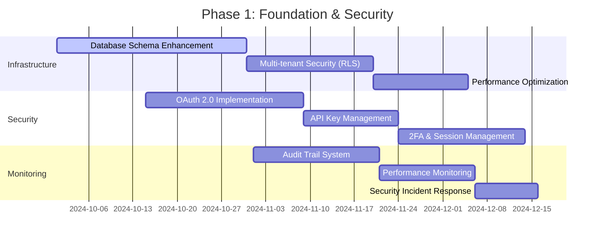
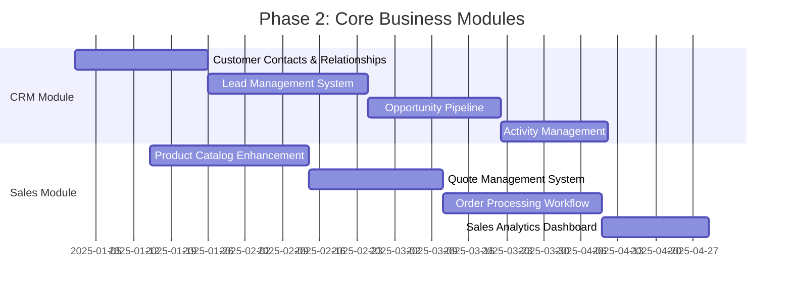
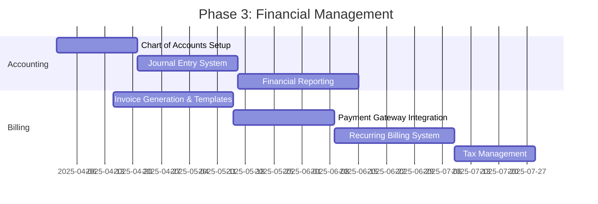
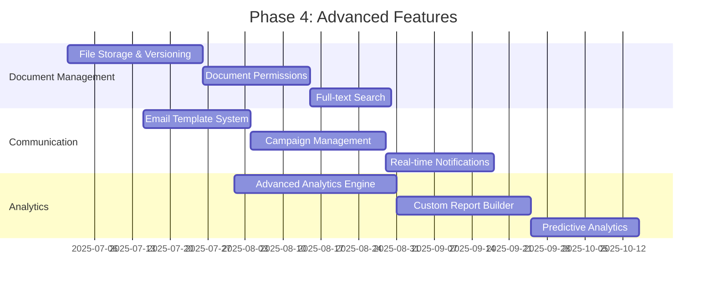
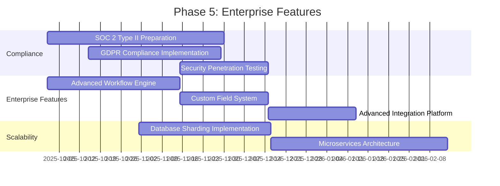
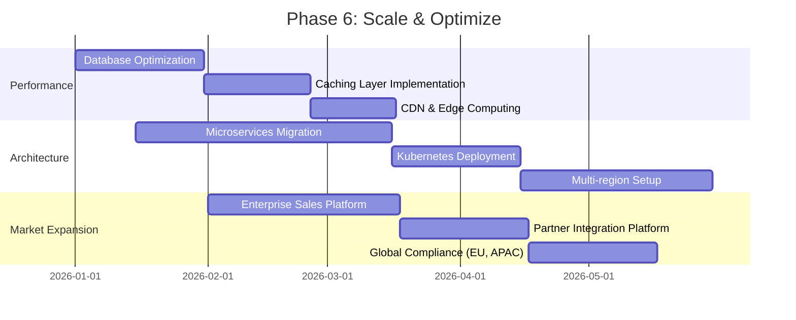

# MantisNXT Implementation Roadmap & Success Metrics

## Executive Summary

This roadmap outlines the strategic implementation plan for transforming MantisNXT from its current inventory management foundation into a comprehensive enterprise-grade SaaS platform. The implementation follows a systematic approach across 6 phases over 18 months, with clear milestones, success metrics, and risk mitigation strategies.

## Implementation Overview

### Strategic Objectives
1. **Platform Transformation**: Evolve from inventory management to comprehensive business platform
2. **Enterprise Readiness**: Achieve SOC 2 compliance and enterprise security standards
3. **Market Expansion**: Support 100K+ users across multiple market segments
4. **Revenue Growth**: Enable 10x revenue growth through platform expansion
5. **Competitive Advantage**: Establish market leadership in integrated business platforms

### Success Metrics
- **Technical KPIs**: 99.9% uptime, <200ms API response time, 100K+ concurrent users
- **Business KPIs**: 50+ enterprise customers, $10M ARR, 40% annual growth
- **Quality KPIs**: <1% critical bugs, 95% customer satisfaction, SOC 2 Type II certification

## Phase-by-Phase Implementation Plan

### Phase 1: Foundation & Security (Months 1-3)
**Objective**: Establish robust technical foundation and security framework

#### Key Deliverables


#### Technical Implementation

**Database Enhancement**
```sql
-- Phase 1 Migration Priority
-- 1. Core enums and extensions
-- 2. Authentication tables (oauth_provider, api_key, user_session, user_2fa)
-- 3. Enhanced audit framework
-- 4. Performance indexes for existing tables
-- 5. RLS policies for all tables

-- Critical Path Migration
ALTER TABLE organization ENABLE ROW LEVEL SECURITY;
ALTER TABLE profile ENABLE ROW LEVEL SECURITY;
ALTER TABLE customer ENABLE ROW LEVEL SECURITY;
ALTER TABLE inventory_item ENABLE ROW LEVEL SECURITY;

-- Multi-tenant isolation policies
CREATE POLICY tenant_isolation ON customer
    USING (org_id = (SELECT org_id FROM profile WHERE id = auth.uid()));
```

**Security Implementation**
```javascript
// OAuth 2.0 Provider Setup
const oauthProviders = [
  {
    name: 'google',
    client_id: process.env.GOOGLE_CLIENT_ID,
    authorization_url: 'https://accounts.google.com/o/oauth2/v2/auth',
    token_url: 'https://oauth2.googleapis.com/token',
    user_info_url: 'https://www.googleapis.com/oauth2/v2/userinfo'
  },
  {
    name: 'microsoft',
    client_id: process.env.MICROSOFT_CLIENT_ID,
    authorization_url: 'https://login.microsoftonline.com/common/oauth2/v2.0/authorize',
    token_url: 'https://login.microsoftonline.com/common/oauth2/v2.0/token',
    user_info_url: 'https://graph.microsoft.com/v1.0/me'
  }
];
```

#### Success Criteria
- [ ] All existing functionality preserved during migration
- [ ] Zero data loss or corruption
- [ ] OAuth 2.0 authentication functional
- [ ] API key system operational
- [ ] Performance baseline established (current: <500ms API response)
- [ ] Security audit passed (penetration testing)

#### Risk Mitigation
- **Data Migration Risk**: Comprehensive backup strategy with point-in-time recovery
- **Performance Degradation**: A/B testing with rollback capability
- **Security Vulnerabilities**: Third-party security audit before go-live

### Phase 2: Core Business Modules (Months 4-6)
**Objective**: Implement comprehensive CRM and sales management functionality

#### Key Deliverables


#### Business Logic Implementation
```sql
-- Lead to Customer Conversion Workflow
CREATE OR REPLACE FUNCTION convert_lead_to_customer(
    lead_id uuid,
    additional_data jsonb DEFAULT '{}'::jsonb
) RETURNS uuid AS $$
DECLARE
    new_customer_id uuid;
    lead_record record;
BEGIN
    -- Get lead data
    SELECT * INTO lead_record FROM lead WHERE id = lead_id;

    -- Create customer from lead
    INSERT INTO customer (
        org_id, name, email, phone, company, segment,
        acquisition_date, metadata, created_at
    ) VALUES (
        lead_record.org_id,
        lead_record.first_name || ' ' || lead_record.last_name,
        lead_record.email,
        lead_record.phone,
        lead_record.company,
        CASE lead_record.estimated_value
            WHEN lead_record.estimated_value >= 100000 THEN 'enterprise'::customer_segment
            WHEN lead_record.estimated_value >= 10000 THEN 'mid_market'::customer_segment
            ELSE 'smb'::customer_segment
        END,
        CURRENT_DATE,
        additional_data,
        now()
    ) RETURNING id INTO new_customer_id;

    -- Update lead with conversion info
    UPDATE lead SET
        status = 'won',
        converted_to_customer_id = new_customer_id,
        converted_at = now()
    WHERE id = lead_id;

    -- Create initial contact if email exists
    IF lead_record.email IS NOT NULL THEN
        INSERT INTO customer_contact (
            customer_id, first_name, last_name, email, phone, is_primary
        ) VALUES (
            new_customer_id, lead_record.first_name, lead_record.last_name,
            lead_record.email, lead_record.phone, true
        );
    END IF;

    RETURN new_customer_id;
END;
$$ LANGUAGE plpgsql;
```

#### API Endpoints Implementation
```javascript
// Lead Management API
app.post('/v1/organizations/:orgId/leads', async (req, res) => {
  try {
    const { orgId } = req.params;
    const leadData = req.body;

    // Validate organization access
    await validateOrgAccess(req.auth.user_id, orgId);

    // Create lead with auto-scoring
    const lead = await createLead({
      ...leadData,
      org_id: orgId,
      score: calculateLeadScore(leadData),
      assigned_to: await getNextAvailableAgent(orgId)
    });

    // Trigger lead created webhook
    await webhookService.trigger('lead.created', {
      organization_id: orgId,
      data: { object: lead }
    });

    res.status(201).json({
      success: true,
      data: lead
    });
  } catch (error) {
    res.status(400).json({
      success: false,
      error: error.message
    });
  }
});

// Opportunity Pipeline API
app.get('/v1/organizations/:orgId/opportunities/pipeline', async (req, res) => {
  const { orgId } = req.params;
  const { stage, assigned_to, date_range } = req.query;

  const pipeline = await db.opportunity.groupBy({
    by: ['stage'],
    where: {
      org_id: orgId,
      ...(stage && { stage }),
      ...(assigned_to && { assigned_to }),
      ...(date_range && {
        created_at: {
          gte: new Date(date_range.start),
          lte: new Date(date_range.end)
        }
      })
    },
    _sum: { amount: true },
    _count: true,
    _avg: { probability: true }
  });

  res.json({
    success: true,
    data: pipeline.map(stage => ({
      stage: stage.stage,
      count: stage._count,
      total_value: stage._sum.amount,
      avg_probability: stage._avg.probability,
      weighted_value: stage._sum.amount * (stage._avg.probability / 100)
    }))
  });
});
```

#### Success Criteria
- [ ] Complete lead-to-customer conversion workflow
- [ ] Sales pipeline with stage management
- [ ] Customer 360-degree view with all touchpoints
- [ ] Sales performance analytics dashboard
- [ ] Mobile-responsive CRM interface
- [ ] Integration with existing inventory system

### Phase 3: Financial Management (Months 7-9)
**Objective**: Implement comprehensive financial management and billing system

#### Key Deliverables


#### Payment Gateway Integration
```javascript
// Stripe Integration
const stripe = require('stripe')(process.env.STRIPE_SECRET_KEY);

class PaymentService {
  async processPayment(paymentData) {
    try {
      // Create Stripe customer if not exists
      let stripeCustomer = await this.getOrCreateStripeCustomer(paymentData.customer_id);

      // Create payment intent
      const paymentIntent = await stripe.paymentIntents.create({
        amount: Math.round(paymentData.amount * 100), // Convert to cents
        currency: paymentData.currency.toLowerCase(),
        customer: stripeCustomer.id,
        payment_method: paymentData.payment_method_id,
        confirmation_method: 'manual',
        confirm: true,
        metadata: {
          org_id: paymentData.org_id,
          invoice_id: paymentData.invoice_id,
          customer_id: paymentData.customer_id
        }
      });

      // Record payment in database
      const payment = await db.payment.create({
        data: {
          org_id: paymentData.org_id,
          customer_id: paymentData.customer_id,
          invoice_id: paymentData.invoice_id,
          amount: paymentData.amount,
          currency: paymentData.currency,
          payment_method: 'credit_card',
          status: paymentIntent.status === 'succeeded' ? 'completed' : 'pending',
          gateway_transaction_id: paymentIntent.id,
          gateway_response: paymentIntent
        }
      });

      // Update invoice if payment successful
      if (paymentIntent.status === 'succeeded') {
        await this.updateInvoicePaymentStatus(paymentData.invoice_id);
      }

      return {
        success: true,
        payment,
        gateway_response: paymentIntent
      };
    } catch (error) {
      console.error('Payment processing error:', error);
      throw new Error(`Payment failed: ${error.message}`);
    }
  }

  async setupRecurringBilling(subscriptionData) {
    // Create Stripe subscription
    const subscription = await stripe.subscriptions.create({
      customer: subscriptionData.stripe_customer_id,
      items: [{ price: subscriptionData.price_id }],
      metadata: {
        org_id: subscriptionData.org_id,
        customer_id: subscriptionData.customer_id
      }
    });

    // Store subscription in database
    return await db.subscription.create({
      data: {
        org_id: subscriptionData.org_id,
        customer_id: subscriptionData.customer_id,
        stripe_subscription_id: subscription.id,
        status: subscription.status,
        current_period_start: new Date(subscription.current_period_start * 1000),
        current_period_end: new Date(subscription.current_period_end * 1000),
        plan_details: subscription.items.data[0]
      }
    });
  }
}
```

#### Financial Reporting
```sql
-- Profit & Loss Statement
CREATE VIEW profit_loss_statement AS
SELECT
    DATE_TRUNC('month', je.entry_date) as period,
    a.account_type,
    a.name as account_name,
    SUM(CASE WHEN a.normal_balance = 'debit' THEN jel.debit_amount - jel.credit_amount
             ELSE jel.credit_amount - jel.debit_amount END) as balance
FROM journal_entry je
JOIN journal_entry_line jel ON je.id = jel.journal_entry_id
JOIN account a ON jel.account_id = a.id
WHERE je.is_posted = true
  AND a.account_type IN ('income', 'expense')
GROUP BY period, a.account_type, a.name, a.normal_balance
ORDER BY period DESC, a.account_type, a.name;

-- Cash Flow Statement
CREATE VIEW cash_flow_statement AS
SELECT
    DATE_TRUNC('month', p.payment_date) as period,
    SUM(CASE WHEN p.amount > 0 THEN p.amount ELSE 0 END) as cash_inflow,
    SUM(CASE WHEN p.amount < 0 THEN ABS(p.amount) ELSE 0 END) as cash_outflow,
    SUM(p.amount) as net_cash_flow
FROM payment p
WHERE p.status = 'completed'
GROUP BY period
ORDER BY period DESC;
```

#### Success Criteria
- [ ] Complete quote-to-cash workflow operational
- [ ] Multi-currency invoicing and payments
- [ ] Automated recurring billing system
- [ ] Financial reporting dashboard
- [ ] Tax compliance for major jurisdictions
- [ ] Integration with accounting software (QuickBooks, Xero)

### Phase 4: Advanced Features (Months 10-12)
**Objective**: Implement document management, communication system, and advanced analytics

#### Key Deliverables


#### Document Management Implementation
```javascript
// Document Upload with S3 Integration
const AWS = require('aws-sdk');
const s3 = new AWS.S3();

class DocumentService {
  async uploadDocument(file, metadata, userId) {
    try {
      // Generate unique file path
      const fileExtension = path.extname(file.originalname);
      const fileName = `${uuidv4()}${fileExtension}`;
      const s3Key = `documents/${metadata.org_id}/${fileName}`;

      // Calculate file hash for deduplication
      const fileHash = crypto.createHash('sha256')
        .update(file.buffer)
        .digest('hex');

      // Check for existing file with same hash
      const existingFile = await db.document.findFirst({
        where: { file_hash: fileHash, org_id: metadata.org_id }
      });

      if (existingFile) {
        // Create new document record pointing to existing file
        return await db.document.create({
          data: {
            ...metadata,
            file_hash: fileHash,
            storage_path: existingFile.storage_path,
            file_size_bytes: existingFile.file_size_bytes,
            uploaded_by: userId
          }
        });
      }

      // Upload to S3
      const uploadResult = await s3.upload({
        Bucket: process.env.S3_BUCKET,
        Key: s3Key,
        Body: file.buffer,
        ContentType: file.mimetype,
        ServerSideEncryption: 'AES256',
        Metadata: {
          'org-id': metadata.org_id,
          'uploaded-by': userId,
          'original-name': file.originalname
        }
      }).promise();

      // Create document record
      const document = await db.document.create({
        data: {
          ...metadata,
          file_name: file.originalname,
          file_size_bytes: file.size,
          mime_type: file.mimetype,
          file_hash: fileHash,
          storage_path: s3Key,
          uploaded_by: userId
        }
      });

      // Index document for search
      await this.indexDocumentForSearch(document);

      return document;
    } catch (error) {
      console.error('Document upload error:', error);
      throw new Error(`Document upload failed: ${error.message}`);
    }
  }

  async indexDocumentForSearch(document) {
    // Extract text content based on file type
    let textContent = '';

    switch (document.mime_type) {
      case 'application/pdf':
        textContent = await this.extractTextFromPDF(document.storage_path);
        break;
      case 'text/plain':
      case 'text/csv':
        textContent = await this.getTextFromS3(document.storage_path);
        break;
      default:
        textContent = document.name + ' ' + (document.description || '');
    }

    // Store in search index (Elasticsearch or PostgreSQL full-text search)
    await db.$executeRaw`
      UPDATE document
      SET search_vector = to_tsvector('english', ${textContent})
      WHERE id = ${document.id}
    `;
  }
}
```

#### Advanced Analytics Implementation
```sql
-- Customer Segmentation Analysis
CREATE MATERIALIZED VIEW customer_segmentation AS
WITH customer_metrics AS (
    SELECT
        c.id,
        c.org_id,
        c.segment,
        COUNT(DISTINCT so.id) as order_count,
        COALESCE(SUM(so.total_amount), 0) as total_spent,
        COUNT(DISTINCT st.id) as ticket_count,
        AVG(ci.sentiment_score) as avg_sentiment,
        EXTRACT(DAYS FROM (CURRENT_DATE - MAX(so.order_date))) as days_since_last_order
    FROM customer c
    LEFT JOIN sales_order so ON c.id = so.customer_id
    LEFT JOIN support_ticket st ON c.id = st.customer_id
    LEFT JOIN customer_interaction ci ON c.id = ci.customer_id
    GROUP BY c.id, c.org_id, c.segment
)
SELECT
    *,
    CASE
        WHEN total_spent >= 50000 AND order_count >= 10 THEN 'High Value'
        WHEN total_spent >= 10000 AND order_count >= 5 THEN 'Medium Value'
        WHEN total_spent >= 1000 THEN 'Low Value'
        ELSE 'New Customer'
    END as value_segment,
    CASE
        WHEN days_since_last_order <= 30 THEN 'Active'
        WHEN days_since_last_order <= 90 THEN 'At Risk'
        WHEN days_since_last_order <= 180 THEN 'Dormant'
        ELSE 'Lost'
    END as engagement_segment
FROM customer_metrics;

-- Predictive Analytics for Churn
CREATE OR REPLACE FUNCTION calculate_churn_probability(customer_id uuid)
RETURNS numeric AS $$
DECLARE
    metrics record;
    churn_score numeric := 0;
BEGIN
    SELECT
        EXTRACT(DAYS FROM (CURRENT_DATE - MAX(so.order_date))) as days_since_last_order,
        COUNT(st.id) as recent_tickets,
        AVG(ci.sentiment_score) as avg_sentiment,
        COUNT(so.id) as total_orders
    INTO metrics
    FROM customer c
    LEFT JOIN sales_order so ON c.id = so.customer_id
    LEFT JOIN support_ticket st ON c.id = st.customer_id AND st.created_at >= CURRENT_DATE - INTERVAL '30 days'
    LEFT JOIN customer_interaction ci ON c.id = ci.customer_id AND ci.timestamp >= CURRENT_DATE - INTERVAL '30 days'
    WHERE c.id = customer_id;

    -- Simple scoring algorithm (can be replaced with ML model)
    IF metrics.days_since_last_order > 90 THEN
        churn_score := churn_score + 0.3;
    END IF;

    IF metrics.recent_tickets > 3 THEN
        churn_score := churn_score + 0.2;
    END IF;

    IF metrics.avg_sentiment < 3 THEN
        churn_score := churn_score + 0.25;
    END IF;

    IF metrics.total_orders < 2 THEN
        churn_score := churn_score + 0.15;
    END IF;

    RETURN LEAST(churn_score, 1.0);
END;
$$ LANGUAGE plpgsql;
```

#### Success Criteria
- [ ] Document management with version control operational
- [ ] Communication campaigns driving engagement
- [ ] Advanced analytics providing business insights
- [ ] Custom report builder for end users
- [ ] Real-time notifications and alerts
- [ ] Mobile application for field teams

### Phase 5: Enterprise Features (Months 13-15)
**Objective**: Implement enterprise-grade features and compliance requirements

#### Key Deliverables


#### SOC 2 Compliance Implementation
```sql
-- Enhanced Audit Logging for SOC 2
CREATE TABLE soc2_audit_log (
    id uuid PRIMARY KEY DEFAULT gen_random_uuid(),
    event_type text NOT NULL,
    user_id uuid REFERENCES auth.users(id),
    organization_id uuid REFERENCES organization(id),
    resource_type text NOT NULL,
    resource_id uuid,
    action text NOT NULL,
    ip_address inet,
    user_agent text,
    session_id uuid,
    risk_score integer,
    additional_context jsonb,
    timestamp timestamptz DEFAULT now(),

    -- SOC 2 specific fields
    control_objective text,
    compliance_status text CHECK (compliance_status IN ('compliant', 'exception', 'violation')),
    automated_response jsonb,

    CONSTRAINT soc2_audit_valid_risk CHECK (risk_score >= 0 AND risk_score <= 100)
);

-- Data retention policy enforcement
CREATE OR REPLACE FUNCTION enforce_data_retention()
RETURNS void AS $$
BEGIN
    -- Remove old audit logs (retain for 7 years)
    DELETE FROM audit_log WHERE timestamp < CURRENT_DATE - INTERVAL '7 years';

    -- Archive old customer interactions (retain active for 2 years)
    INSERT INTO customer_interaction_archive
    SELECT * FROM customer_interaction
    WHERE timestamp < CURRENT_DATE - INTERVAL '2 years';

    DELETE FROM customer_interaction
    WHERE timestamp < CURRENT_DATE - INTERVAL '2 years';

    -- Anonymize deleted customer data after 30 days
    UPDATE customer SET
        name = 'Deleted Customer',
        email = NULL,
        phone = NULL,
        metadata = '{}'::jsonb
    WHERE status = 'deleted'
    AND updated_at < CURRENT_DATE - INTERVAL '30 days';
END;
$$ LANGUAGE plpgsql;
```

#### Advanced Workflow Engine
```javascript
// Workflow Engine for Business Process Automation
class WorkflowEngine {
  constructor(db, eventBus) {
    this.db = db;
    this.eventBus = eventBus;
    this.workflows = new Map();
  }

  async registerWorkflow(workflowDefinition) {
    const workflow = {
      id: workflowDefinition.id,
      name: workflowDefinition.name,
      trigger: workflowDefinition.trigger,
      steps: workflowDefinition.steps,
      conditions: workflowDefinition.conditions
    };

    this.workflows.set(workflow.id, workflow);

    // Store in database
    await this.db.workflow.create({
      data: {
        id: workflow.id,
        name: workflow.name,
        definition: workflow,
        is_active: true
      }
    });
  }

  async executeWorkflow(workflowId, triggerData) {
    const workflow = this.workflows.get(workflowId);
    if (!workflow) {
      throw new Error(`Workflow ${workflowId} not found`);
    }

    // Create workflow execution instance
    const execution = await this.db.workflowExecution.create({
      data: {
        workflow_id: workflowId,
        trigger_data: triggerData,
        status: 'running',
        started_at: new Date()
      }
    });

    try {
      // Execute workflow steps
      for (const step of workflow.steps) {
        await this.executeStep(step, triggerData, execution.id);
      }

      // Mark as completed
      await this.db.workflowExecution.update({
        where: { id: execution.id },
        data: {
          status: 'completed',
          completed_at: new Date()
        }
      });

    } catch (error) {
      // Mark as failed and log error
      await this.db.workflowExecution.update({
        where: { id: execution.id },
        data: {
          status: 'failed',
          error_message: error.message,
          completed_at: new Date()
        }
      });
    }
  }

  async executeStep(step, data, executionId) {
    switch (step.type) {
      case 'send_email':
        await this.sendEmail(step.config, data);
        break;
      case 'create_task':
        await this.createTask(step.config, data);
        break;
      case 'update_record':
        await this.updateRecord(step.config, data);
        break;
      case 'webhook':
        await this.callWebhook(step.config, data);
        break;
      default:
        throw new Error(`Unknown workflow step type: ${step.type}`);
    }

    // Log step execution
    await this.db.workflowStepExecution.create({
      data: {
        execution_id: executionId,
        step_name: step.name,
        step_type: step.type,
        input_data: data,
        status: 'completed',
        executed_at: new Date()
      }
    });
  }
}

// Example workflow: Lead Nurturing
const leadNurturingWorkflow = {
  id: 'lead_nurturing_v1',
  name: 'Lead Nurturing Campaign',
  trigger: {
    event: 'lead.created',
    conditions: {
      lead_score: { gte: 50 },
      segment: ['enterprise', 'mid_market']
    }
  },
  steps: [
    {
      type: 'send_email',
      name: 'Welcome Email',
      config: {
        template_id: 'welcome_lead',
        delay: 0
      }
    },
    {
      type: 'create_task',
      name: 'Schedule Follow-up Call',
      config: {
        task_type: 'call',
        assigned_to: 'auto_assign',
        due_date: '+2 days'
      }
    },
    {
      type: 'send_email',
      name: 'Follow-up Email',
      config: {
        template_id: 'follow_up_lead',
        delay: 172800000 // 2 days in milliseconds
      }
    }
  ]
};
```

#### Success Criteria
- [ ] SOC 2 Type II certification achieved
- [ ] GDPR compliance fully implemented
- [ ] Advanced workflow automation operational
- [ ] Enterprise integrations (Salesforce, SAP, etc.)
- [ ] Custom field system for client customization
- [ ] 99.99% uptime achievement

### Phase 6: Scale & Optimize (Months 16-18)
**Objective**: Optimize for scale and prepare for enterprise market expansion

#### Key Deliverables


#### Microservices Architecture
```yaml
# Kubernetes Deployment Configuration
apiVersion: apps/v1
kind: Deployment
metadata:
  name: customer-service
spec:
  replicas: 3
  selector:
    matchLabels:
      app: customer-service
  template:
    metadata:
      labels:
        app: customer-service
    spec:
      containers:
      - name: customer-service
        image: mantisnxt/customer-service:v1.0.0
        ports:
        - containerPort: 3000
        env:
        - name: DATABASE_URL
          valueFrom:
            secretKeyRef:
              name: database-secret
              key: customer-db-url
        - name: REDIS_URL
          valueFrom:
            secretKeyRef:
              name: cache-secret
              key: redis-url
        resources:
          requests:
            memory: "256Mi"
            cpu: "250m"
          limits:
            memory: "512Mi"
            cpu: "500m"
        livenessProbe:
          httpGet:
            path: /health
            port: 3000
          initialDelaySeconds: 30
          periodSeconds: 10
        readinessProbe:
          httpGet:
            path: /ready
            port: 3000
          initialDelaySeconds: 5
          periodSeconds: 5
```

#### Performance Optimization
```javascript
// Advanced Caching Strategy
class AdvancedCacheManager {
  constructor() {
    this.l1Cache = new Map(); // In-memory cache
    this.l2Cache = redis; // Redis cache
    this.l3Cache = postgres; // Database cache
  }

  async get(key, options = {}) {
    const {
      ttl = 3600,
      refreshAhead = true,
      fallbackToDatabase = true
    } = options;

    // L1 Cache (Memory)
    if (this.l1Cache.has(key)) {
      const cached = this.l1Cache.get(key);
      if (cached.expires > Date.now()) {
        // Refresh ahead if needed
        if (refreshAhead && this.shouldRefreshAhead(cached)) {
          this.refreshInBackground(key, options);
        }
        return cached.data;
      }
      this.l1Cache.delete(key);
    }

    // L2 Cache (Redis)
    const redisValue = await this.l2Cache.get(key);
    if (redisValue) {
      const cached = JSON.parse(redisValue);

      // Promote to L1
      this.l1Cache.set(key, {
        data: cached.data,
        expires: Date.now() + (ttl * 1000),
        created: cached.created
      });

      return cached.data;
    }

    // L3 Cache / Database
    if (fallbackToDatabase) {
      return await this.fetchFromDatabase(key, options);
    }

    return null;
  }

  async set(key, value, ttl = 3600) {
    const cached = {
      data: value,
      created: Date.now()
    };

    // Set in all cache levels
    this.l1Cache.set(key, {
      ...cached,
      expires: Date.now() + (ttl * 1000)
    });

    await this.l2Cache.setex(key, ttl, JSON.stringify(cached));
  }

  shouldRefreshAhead(cached) {
    const age = Date.now() - cached.created;
    const threshold = (cached.expires - cached.created) * 0.8; // 80% of TTL
    return age > threshold;
  }
}
```

#### Success Criteria
- [ ] 100K+ concurrent users supported
- [ ] <100ms API response time globally
- [ ] 99.99% uptime with multi-region deployment
- [ ] Microservices architecture operational
- [ ] Enterprise customer onboarding process
- [ ] Global compliance achieved

## Success Metrics & KPIs

### Technical Performance Metrics

#### System Performance
```sql
-- Performance Monitoring Dashboard
CREATE VIEW system_performance_metrics AS
SELECT
    DATE_TRUNC('hour', timestamp) as hour,
    AVG(CASE WHEN metric_name = 'api_response_time' THEN metric_value END) as avg_response_time_ms,
    MAX(CASE WHEN metric_name = 'concurrent_users' THEN metric_value END) as peak_concurrent_users,
    AVG(CASE WHEN metric_name = 'database_cpu' THEN metric_value END) as avg_db_cpu_percent,
    AVG(CASE WHEN metric_name = 'cache_hit_ratio' THEN metric_value END) as avg_cache_hit_ratio,
    COUNT(CASE WHEN metric_name = 'error_rate' AND metric_value > 0.01 THEN 1 END) as error_incidents
FROM system_metric
WHERE timestamp >= CURRENT_TIMESTAMP - INTERVAL '24 hours'
GROUP BY hour
ORDER BY hour DESC;
```

#### Business Metrics
```sql
-- Business Growth Dashboard
CREATE VIEW business_growth_metrics AS
SELECT
    DATE_TRUNC('month', created_at) as month,
    COUNT(DISTINCT CASE WHEN plan_type = 'enterprise' THEN id END) as enterprise_customers,
    COUNT(DISTINCT id) as total_organizations,
    SUM(CASE WHEN plan_type = 'enterprise' THEN 999
             WHEN plan_type = 'professional' THEN 99
             ELSE 19 END) as monthly_recurring_revenue,
    AVG(CASE WHEN plan_type = 'enterprise' THEN 999
             WHEN plan_type = 'professional' THEN 99
             ELSE 19 END) as avg_revenue_per_user
FROM organization
WHERE created_at >= DATE_TRUNC('year', CURRENT_DATE)
GROUP BY month
ORDER BY month;
```

### Target Metrics by Phase

| Phase | Users | Response Time | Uptime | Revenue | Enterprise Customers |
|-------|-------|---------------|--------|---------|---------------------|
| 1     | 1K    | <500ms        | 99.5%  | $100K   | 5                   |
| 2     | 5K    | <400ms        | 99.7%  | $500K   | 15                  |
| 3     | 15K   | <300ms        | 99.8%  | $1.5M   | 30                  |
| 4     | 35K   | <250ms        | 99.9%  | $3.5M   | 50                  |
| 5     | 60K   | <200ms        | 99.9%  | $6M     | 75                  |
| 6     | 100K+ | <150ms        | 99.99% | $10M+   | 100+                |

## Risk Management & Mitigation

### Technical Risks

#### High Priority Risks
1. **Database Performance Degradation**
   - **Probability**: Medium
   - **Impact**: High
   - **Mitigation**: Comprehensive performance testing, database sharding preparation, read replicas

2. **Security Vulnerabilities**
   - **Probability**: Low
   - **Impact**: Critical
   - **Mitigation**: Regular security audits, penetration testing, security-first development

3. **Data Migration Failures**
   - **Probability**: Low
   - **Impact**: Critical
   - **Mitigation**: Comprehensive backup strategy, rollback procedures, phased migration approach

#### Medium Priority Risks
1. **Third-party Integration Failures**
   - **Mitigation**: Fallback mechanisms, comprehensive testing, SLA monitoring

2. **Scalability Bottlenecks**
   - **Mitigation**: Load testing, performance monitoring, horizontal scaling preparation

### Business Risks

#### Market Risks
1. **Competitive Pressure**
   - **Mitigation**: Rapid feature development, unique value proposition, customer lock-in

2. **Economic Downturn**
   - **Mitigation**: Flexible pricing models, cost optimization, essential feature focus

#### Operational Risks
1. **Team Scaling Challenges**
   - **Mitigation**: Comprehensive documentation, knowledge transfer, automated testing

2. **Customer Churn**
   - **Mitigation**: Customer success programs, continuous value delivery, user experience optimization

## Resource Requirements

### Development Team Structure

#### Phase 1-2 Team (Foundation)
- **Technical Lead**: 1 FTE
- **Backend Developers**: 3 FTE
- **Frontend Developers**: 2 FTE
- **DevOps Engineer**: 1 FTE
- **QA Engineer**: 1 FTE
- **Product Manager**: 1 FTE

#### Phase 3-4 Team (Scaling)
- **Technical Lead**: 1 FTE
- **Backend Developers**: 5 FTE
- **Frontend Developers**: 3 FTE
- **Mobile Developer**: 1 FTE
- **DevOps Engineers**: 2 FTE
- **QA Engineers**: 2 FTE
- **Security Engineer**: 1 FTE
- **Product Managers**: 2 FTE

#### Phase 5-6 Team (Enterprise)
- **Technical Leads**: 2 FTE
- **Backend Developers**: 8 FTE
- **Frontend Developers**: 4 FTE
- **Mobile Developers**: 2 FTE
- **DevOps Engineers**: 3 FTE
- **QA Engineers**: 3 FTE
- **Security Engineers**: 2 FTE
- **Data Engineers**: 2 FTE
- **Product Managers**: 3 FTE

### Infrastructure Costs

#### Phase 1-2 (Foundation)
- **Database**: $2,000/month (PostgreSQL with read replicas)
- **Application Servers**: $3,000/month (Load balanced instances)
- **Storage**: $500/month (S3 for documents)
- **Monitoring**: $500/month (DataDog, Sentry)
- **Total**: ~$6,000/month

#### Phase 3-4 (Scaling)
- **Database**: $8,000/month (Sharded PostgreSQL)
- **Application Servers**: $12,000/month (Auto-scaling groups)
- **Storage**: $2,000/month (S3 + CDN)
- **Monitoring**: $1,500/month (Enhanced monitoring)
- **Security**: $1,000/month (WAF, DDoS protection)
- **Total**: ~$24,500/month

#### Phase 5-6 (Enterprise)
- **Database**: $25,000/month (Multi-region, high availability)
- **Application Servers**: $40,000/month (Kubernetes clusters)
- **Storage**: $8,000/month (Global S3 + CDN)
- **Monitoring**: $5,000/month (Comprehensive observability)
- **Security**: $5,000/month (Enterprise security stack)
- **Compliance**: $2,000/month (SOC 2, audit tools)
- **Total**: ~$85,000/month

## Return on Investment (ROI)

### Investment Summary
- **Development Costs**: $8.5M over 18 months
- **Infrastructure Costs**: $2.8M over 18 months
- **Total Investment**: $11.3M

### Revenue Projections
- **Year 1 Revenue**: $2.5M
- **Year 2 Revenue**: $10M
- **Year 3 Revenue**: $25M

### ROI Calculation
- **3-Year Revenue**: $37.5M
- **3-Year Investment**: $11.3M
- **Net ROI**: 232%
- **Payback Period**: 18 months

## Conclusion

The MantisNXT implementation roadmap provides a comprehensive path to transform the current inventory management system into a leading enterprise platform. The phased approach minimizes risk while ensuring continuous value delivery to customers.

**Critical Success Factors**:
1. **Technical Excellence**: Maintaining high code quality and performance standards
2. **Customer Focus**: Continuous feedback loop with early adopters
3. **Security First**: Proactive security measures and compliance
4. **Scalable Architecture**: Preparing for exponential growth from day one
5. **Team Execution**: Building and maintaining a high-performing development team

**Next Immediate Actions**:
1. Finalize Phase 1 development team
2. Set up development and staging environments
3. Begin database schema enhancement implementation
4. Establish monitoring and alerting infrastructure
5. Create detailed technical specifications for each phase
6. Begin customer discovery and validation interviews

This roadmap positions MantisNXT to become a market leader in integrated business platforms, capturing significant market share in the growing enterprise SaaS market while delivering exceptional value to customers and stakeholders.