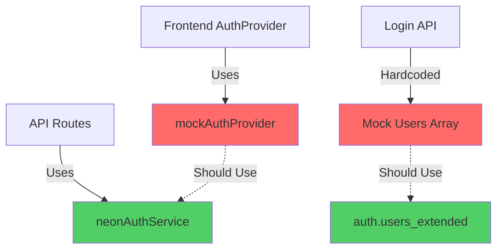
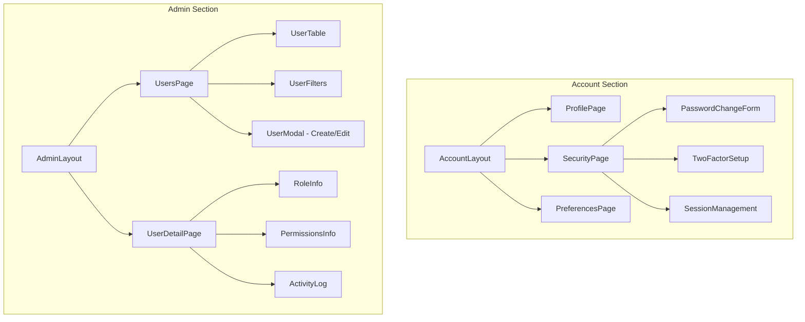
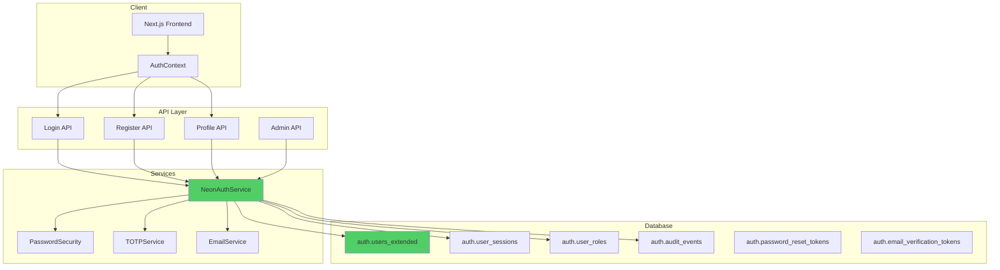

# Account Management System Architecture

## Phase 1: Comprehensive Audit & Design

---

## 1. Current State Summary

### Database Schema (Exists in SQL, needs verification)

**Auth Schema Tables:**
| Table | Status | Notes |
|-------|--------|-------|
| `auth.users` | ✅ Basic | `id`, `email`, `encrypted_password`, `created_at` |
| `auth.users_extended` | ✅ Full | Extended profile fields, org_id, 2FA, activity tracking |
| `auth.user_sessions` | ✅ Exists | Session management with token, expiry, device info |
| `auth.roles` | ✅ Exists | Role definitions with levels |
| `auth.user_roles` | ✅ Exists | User-role assignments with effective dates |
| `auth.permissions` | ✅ Exists | Permission definitions |
| `auth.role_permissions` | ✅ Exists | Role-permission mappings |
| `auth.user_preferences` | ✅ Exists | User preferences (language, timezone, notifications) |
| `auth.audit_events` | ✅ Exists | Comprehensive audit logging |
| `auth.login_history` | ✅ Exists | Login attempt tracking |
| `organization` | ✅ Exists | Multi-tenant organization support |
| `profile` | ✅ Exists | Basic profile linked to auth.users |

### API Endpoints

**Existing:**
| Endpoint | Method | Status | Notes |
|----------|--------|--------|-------|
| `/api/auth/login` | POST | ⚠️ Mock | Uses hardcoded mock users, NOT database |
| `/api/auth/status` | GET | ⚠️ Mock | Checks mock session |
| `/api/v1/auth/login` | POST | ✅ Real | Uses neonAuthService |
| `/api/v1/auth/logout` | POST | ✅ Real | Revokes session |
| `/api/v1/auth/me` | GET | ✅ Real | Returns current user |
| `/api/v1/users/me` | GET/PUT | ⚠️ Partial | GET real, PUT uses mock |
| `/api/v1/admin/users` | GET/POST | ⚠️ Partial | GET real, POST uses mock |
| `/api/v1/admin/users/[id]` | GET/PUT/DELETE | ⚠️ Partial | Uses mock provider |
| `/api/v1/admin/users/[id]/roles` | PUT | ❌ Missing | Route exists, not implemented |
| `/api/v1/admin/users/bulk` | POST | ❌ Missing | Route exists, not implemented |

**Missing:**
- `POST /api/v1/auth/register` - User/org registration
- `POST /api/v1/auth/forgot-password` - Password reset request
- `POST /api/v1/auth/reset-password` - Password reset with token
- `POST /api/v1/auth/verify-email` - Email verification
- `POST /api/v1/auth/resend-verification` - Resend verification email
- `POST /api/v1/users/me/2fa/setup` - Initialize 2FA
- `POST /api/v1/users/me/2fa/verify` - Verify and enable 2FA
- `DELETE /api/v1/users/me/2fa` - Disable 2FA
- `GET /api/v1/users/me/sessions` - List active sessions
- `DELETE /api/v1/users/me/sessions/[id]` - Revoke specific session

### Frontend Components

**Existing:**
| Component | Path | Status |
|-----------|------|--------|
| `AuthProvider` | `src/lib/auth/auth-context.tsx` | ⚠️ Uses mock provider |
| `NavUser` | `src/components/nav-user.tsx` | ✅ Uses auth context |
| `RoleBasedAccess` | `src/components/auth/RoleBasedAccess.tsx` | ✅ Complete |
| `UserTable` | `src/components/admin/users/UserTable.tsx` | ✅ Complete |
| `UserFilters` | `src/components/admin/users/UserFilters.tsx` | ✅ Complete |

**Account Pages:**
| Page | Path | Status |
|------|------|--------|
| Profile | `/account/profile` | ✅ Basic form |
| Security | `/account/security` | ⚠️ Password change, 2FA display only |
| Settings | `/account/settings` | ✅ Exists |
| Preferences | `/account/preferences` | ✅ Exists |

**Admin Pages:**
| Page | Path | Status |
|------|------|--------|
| Users List | `/admin/users` | ✅ Complete with filters |
| User Details | `/admin/users/[id]` | ❌ Missing |
| Roles Management | `/admin/users/[id]/roles` | ❌ Missing |
| Bulk Import | `/admin/users/bulk` | ❌ Missing |

### Service Layer

**Existing:**
| Service | Path | Status |
|---------|------|--------|
| `NeonAuthService` | `src/lib/auth/neon-auth-service.ts` | ✅ Production-ready |
| `MockAuthProvider` | `src/lib/auth/mock-provider.ts` | ⚠️ Currently used by frontend |
| `passwordSecurity` | `src/lib/security/password-security.ts` | ✅ Complete |
| `totpService` | `src/lib/security/totp-service.ts` | ✅ Referenced |

---

## 2. Gap Analysis

### Critical Issues



| Issue | Severity | Impact |
|-------|----------|--------|
| Frontend uses mock auth, not real DB | 🔴 Critical | No real authentication |
| Login API uses hardcoded mock users | 🔴 Critical | Cannot add new users |
| No user registration flow | 🔴 Critical | Cannot onboard customers |
| No password reset flow | 🔴 Critical | Users locked out permanently |
| No email verification | 🟠 High | Security vulnerability |
| 2FA setup not implemented | 🟠 High | 2FA toggle is display-only |
| Admin user creation uses mock | 🟠 High | Created users not persisted |
| Session management incomplete | 🟡 Medium | Cannot revoke sessions |

### Missing Production Features

**Authentication:**
- [ ] Database-backed user authentication
- [ ] User registration with email verification
- [ ] Password reset/forgot password flow
- [ ] Account lockout after failed attempts (exists in neonAuthService)
- [ ] Session management UI

**Two-Factor Authentication:**
- [ ] TOTP setup flow with QR code
- [ ] Backup codes generation
- [ ] 2FA verification on login (exists in neonAuthService)
- [ ] 2FA recovery flow

**User Management:**
- [ ] Admin: Create user with DB persistence
- [ ] Admin: User invitation via email
- [ ] Admin: Bulk user import from CSV
- [ ] Admin: User detail/edit page
- [ ] Admin: Role assignment UI

**Profile Management:**
- [ ] Avatar upload
- [ ] Profile update API (real)
- [ ] Password change API (real)
- [ ] User preferences persistence

---

## 3. Proposed Schema Design

### Enhanced auth.users_extended

```sql
-- Already exists, verify columns:
CREATE TABLE IF NOT EXISTS auth.users_extended (
    id uuid PRIMARY KEY DEFAULT gen_random_uuid(),
    stack_auth_user_id text UNIQUE,
    email text UNIQUE NOT NULL,
    email_verified boolean DEFAULT false,
    encrypted_password text NOT NULL,
    
    -- Profile
    first_name text,
    last_name text,
    display_name text NOT NULL,
    avatar_url text,
    phone text,
    mobile text,
    
    -- Organization
    org_id uuid NOT NULL REFERENCES organization(id),
    department text,
    job_title text,
    
    -- Status
    is_active boolean DEFAULT true,
    is_suspended boolean DEFAULT false,
    suspension_reason text,
    
    -- 2FA
    two_factor_enabled boolean DEFAULT false,
    two_factor_secret text, -- encrypted
    backup_codes jsonb, -- encrypted
    
    -- Tracking
    last_login_at timestamptz,
    last_activity_at timestamptz,
    password_changed_at timestamptz DEFAULT now(),
    failed_login_attempts integer DEFAULT 0,
    locked_until timestamptz,
    
    -- Audit
    created_at timestamptz DEFAULT now(),
    updated_at timestamptz DEFAULT now(),
    created_by uuid REFERENCES auth.users_extended(id)
);
```

### New: auth.password_reset_tokens

```sql
CREATE TABLE IF NOT EXISTS auth.password_reset_tokens (
    id uuid PRIMARY KEY DEFAULT gen_random_uuid(),
    user_id uuid NOT NULL REFERENCES auth.users_extended(id) ON DELETE CASCADE,
    token_hash text NOT NULL UNIQUE,
    expires_at timestamptz NOT NULL,
    used_at timestamptz,
    created_at timestamptz DEFAULT now()
);

CREATE INDEX idx_password_reset_tokens_hash ON auth.password_reset_tokens(token_hash);
CREATE INDEX idx_password_reset_tokens_expires ON auth.password_reset_tokens(expires_at);
```

### New: auth.email_verification_tokens

```sql
CREATE TABLE IF NOT EXISTS auth.email_verification_tokens (
    id uuid PRIMARY KEY DEFAULT gen_random_uuid(),
    user_id uuid NOT NULL REFERENCES auth.users_extended(id) ON DELETE CASCADE,
    email text NOT NULL,
    token_hash text NOT NULL UNIQUE,
    expires_at timestamptz NOT NULL,
    verified_at timestamptz,
    created_at timestamptz DEFAULT now()
);

CREATE INDEX idx_email_verification_hash ON auth.email_verification_tokens(token_hash);
```

### New: auth.user_invitations

```sql
CREATE TABLE IF NOT EXISTS auth.user_invitations (
    id uuid PRIMARY KEY DEFAULT gen_random_uuid(),
    email text NOT NULL,
    org_id uuid NOT NULL REFERENCES organization(id),
    role_id uuid REFERENCES auth.roles(id),
    invited_by uuid NOT NULL REFERENCES auth.users_extended(id),
    token_hash text NOT NULL UNIQUE,
    expires_at timestamptz NOT NULL,
    accepted_at timestamptz,
    user_id uuid REFERENCES auth.users_extended(id),
    created_at timestamptz DEFAULT now()
);

CREATE INDEX idx_invitations_email ON auth.user_invitations(email);
CREATE INDEX idx_invitations_token ON auth.user_invitations(token_hash);
```

---

## 4. API Design

### Authentication Endpoints

#### POST /api/v1/auth/register
```typescript
// Request
{
  email: string;
  password: string;
  firstName: string;
  lastName: string;
  organizationName?: string; // For new org registration
  invitationToken?: string;  // For invited users
}

// Response 201
{
  success: true,
  data: {
    userId: string;
    requiresEmailVerification: true;
  },
  message: "Registration successful. Please verify your email."
}
```

#### POST /api/v1/auth/forgot-password
```typescript
// Request
{ email: string }

// Response 200 (always success to prevent enumeration)
{
  success: true,
  message: "If an account exists, a reset link has been sent."
}
```

#### POST /api/v1/auth/reset-password
```typescript
// Request
{
  token: string;
  password: string;
}

// Response 200
{
  success: true,
  message: "Password reset successful."
}
```

#### POST /api/v1/auth/verify-email
```typescript
// Request
{ token: string }

// Response 200
{
  success: true,
  message: "Email verified successfully."
}
```

### 2FA Endpoints

#### POST /api/v1/users/me/2fa/setup
```typescript
// Response 200
{
  success: true,
  data: {
    secret: string;
    qrCodeUrl: string;
    backupCodes: string[];
  }
}
```

#### POST /api/v1/users/me/2fa/enable
```typescript
// Request
{ code: string, secret: string }

// Response 200
{ success: true, message: "2FA enabled" }
```

#### DELETE /api/v1/users/me/2fa
```typescript
// Request
{ password: string, code: string }

// Response 200
{ success: true, message: "2FA disabled" }
```

### Session Management

#### GET /api/v1/users/me/sessions
```typescript
// Response 200
{
  success: true,
  data: [
    {
      id: string;
      deviceInfo: string;
      ipAddress: string;
      lastActivity: string;
      isCurrent: boolean;
    }
  ]
}
```

#### DELETE /api/v1/users/me/sessions/:id
```typescript
// Response 200
{ success: true, message: "Session revoked" }
```

---

## 5. Frontend Component Design

### Component Hierarchy



### New Components Required

| Component | Path | Purpose |
|-----------|------|---------|
| `TwoFactorSetup` | `src/components/account/TwoFactorSetup.tsx` | QR code, backup codes |
| `SessionList` | `src/components/account/SessionList.tsx` | Active sessions |
| `PasswordResetForm` | `src/components/auth/PasswordResetForm.tsx` | Reset password |
| `EmailVerification` | `src/components/auth/EmailVerification.tsx` | Verify email |
| `UserCreateModal` | `src/components/admin/users/UserCreateModal.tsx` | Create user |
| `UserEditForm` | `src/components/admin/users/UserEditForm.tsx` | Edit user |
| `RoleAssignment` | `src/components/admin/users/RoleAssignment.tsx` | Manage roles |
| `BulkImport` | `src/components/admin/users/BulkImport.tsx` | CSV import |

---

## 6. Admin Panel Requirements

### User Management Dashboard

**Stats Cards:**
- Total Users
- Active Users
- Pending Invitations
- 2FA Adoption Rate

**User Table Features:**
- [x] Search by name/email
- [x] Filter by role
- [x] Filter by status
- [x] Filter by department
- [ ] Bulk actions (activate/deactivate/delete)
- [ ] Export to CSV

**User Detail Page:**
- Profile overview
- Role assignments with effective dates
- Permission summary
- Activity timeline
- Session management
- Account actions (suspend, reset password, force logout)

### Role Management (Future)

- View roles with permission matrix
- Create custom roles
- Clone existing roles
- Permission assignment UI

---

## 7. Security & Compliance

### Password Requirements
```typescript
const passwordPolicy = {
  minLength: 12,
  requireUppercase: true,
  requireLowercase: true,
  requireNumbers: true,
  requireSpecial: true,
  maxAge: 90, // days, optional
  historyCount: 5 // prevent reuse
};
```

### Rate Limiting
| Endpoint | Limit | Window |
|----------|-------|--------|
| `/auth/login` | 5 attempts | 15 minutes |
| `/auth/register` | 3 attempts | 1 hour |
| `/auth/forgot-password` | 3 attempts | 1 hour |
| `/auth/2fa/verify` | 5 attempts | 15 minutes |

### Audit Logging
All auth events logged to `auth.audit_events`:
- login_success, login_failure
- logout
- password_change, password_reset
- 2fa_enabled, 2fa_disabled
- user_created, user_updated, user_deleted
- role_assigned, role_removed
- session_created, session_revoked

### Data Protection
- Passwords: bcrypt with cost 12
- 2FA secrets: AES-256-GCM encrypted
- PII fields: Consider field-level encryption
- Session tokens: Cryptographically random, 256-bit

---

## 8. Implementation Priority

### Phase 1A: Foundation (Week 1)
1. [ ] Wire frontend AuthProvider to real neonAuthService
2. [ ] Fix login API to use database, not mock users
3. [ ] Fix admin user creation to persist to database
4. [ ] Deploy password_reset_tokens migration
5. [ ] Implement forgot-password/reset-password flow

### Phase 1B: Core Auth (Week 2)
6. [ ] Deploy email_verification_tokens migration
7. [ ] Implement email verification flow
8. [ ] Implement user registration API
9. [ ] Create registration page
10. [ ] Connect profile update to real API

### Phase 2A: 2FA (Week 3)
11. [ ] Implement 2FA setup API endpoints
12. [ ] Create TwoFactorSetup component
13. [ ] Integrate 2FA into login flow
14. [ ] Add backup codes management

### Phase 2B: Sessions (Week 3)
15. [ ] Implement session listing API
16. [ ] Create SessionList component
17. [ ] Add session revocation

### Phase 3: Admin (Week 4)
18. [ ] Create user detail page
19. [ ] Implement role assignment UI
20. [ ] Add bulk user import
21. [ ] User invitation flow

---

## 9. Architecture Diagram



---

## 10. Files to Modify

| File | Change |
|------|--------|
| `src/lib/auth/auth-context.tsx` | Replace mockAuthProvider with API calls |
| `src/app/api/auth/login/route.ts` | Remove mock users, use neonAuthService |
| `src/app/api/v1/admin/users/route.ts` | POST: Remove mock provider import |
| `src/app/api/v1/users/me/route.ts` | PUT: Remove mock provider import |
| `src/app/account/security/page.tsx` | Add functional 2FA setup |

## 11. New Files Required

| File | Purpose |
|------|---------|
| `migrations/00XX_auth_tokens.sql` | Password reset + email verification tables |
| `src/app/api/v1/auth/register/route.ts` | User registration |
| `src/app/api/v1/auth/forgot-password/route.ts` | Password reset request |
| `src/app/api/v1/auth/reset-password/route.ts` | Password reset execution |
| `src/app/api/v1/auth/verify-email/route.ts` | Email verification |
| `src/app/api/v1/users/me/2fa/setup/route.ts` | 2FA setup |
| `src/app/api/v1/users/me/2fa/enable/route.ts` | 2FA enable |
| `src/app/api/v1/users/me/sessions/route.ts` | Session management |
| `src/app/auth/register/page.tsx` | Registration page |
| `src/app/auth/forgot-password/page.tsx` | Forgot password page |
| `src/app/auth/reset-password/page.tsx` | Reset password page |
| `src/components/account/TwoFactorSetup.tsx` | 2FA setup UI |
| `src/components/account/SessionList.tsx` | Active sessions UI |
| `src/services/email/email-service.ts` | Email sending service |

---

*Generated: 2024-12-08*
*Phase: 1 - Architecture Design*