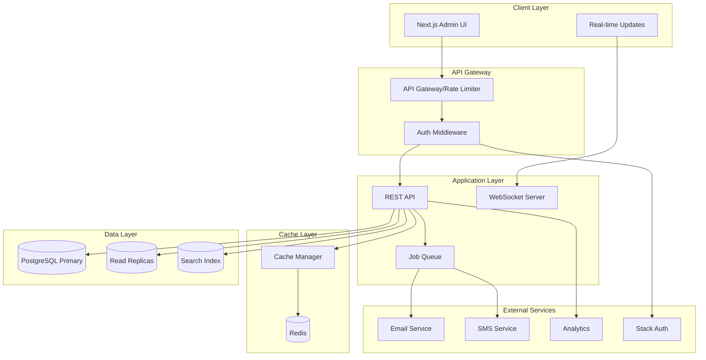

# Phase 2-6 Admin Panel Architecture

## Executive Summary
This document outlines the architecture for MantisNXT's Phase 2-6 admin panel features, focusing on scalability, performance, and enterprise-grade reliability. The architecture supports user management, role-based access control, real-time updates, and seamless integration with existing systems.

## Architecture Overview



## 1. API Architecture

### 1.1 RESTful Endpoints Structure

```typescript
// Base URL: /api/v2/admin

// User Management
GET    /users                    // List users with pagination
GET    /users/:id                // Get single user
POST   /users                    // Create user
PUT    /users/:id                // Update user
DELETE /users/:id                // Delete user
POST   /users/bulk               // Bulk import
PUT    /users/bulk               // Bulk update
DELETE /users/bulk               // Bulk delete

// Role & Permission Management
GET    /roles                    // List all roles
GET    /roles/:id                // Get role details
POST   /roles                    // Create custom role
PUT    /roles/:id                // Update role
DELETE /roles/:id                // Delete role
GET    /permissions              // List all permissions
POST   /roles/:id/permissions    // Assign permissions
DELETE /roles/:id/permissions    // Remove permissions

// Activity & Audit
GET    /audit-logs              // Get audit logs
GET    /audit-logs/export       // Export audit logs
GET    /activities/user/:id    // User activity history
GET    /activities/recent       // Recent system activities

// Session Management
GET    /sessions                // List active sessions
DELETE /sessions/:id            // Terminate session
POST   /sessions/bulk-terminate // Terminate multiple sessions

// Real-time & Notifications
GET    /notifications           // Get notifications
PUT    /notifications/:id/read // Mark as read
POST   /notifications/send      // Send notification
```

### 1.2 API Implementation Structure

```typescript
// src/app/api/v2/admin/users/route.ts
import { NextRequest, NextResponse } from 'next/server';
import { z } from 'zod';
import { withAuth, withRateLimit, withCache } from '@/lib/api/middleware';
import { UserService } from '@/lib/services/user.service';
import { CacheManager } from '@/lib/cache/manager';
import { AuditLogger } from '@/lib/audit/logger';

const listUsersSchema = z.object({
  page: z.number().default(1),
  limit: z.number().default(20).max(100),
  search: z.string().optional(),
  role: z.string().optional(),
  status: z.enum(['active', 'inactive', 'all']).default('all'),
  sortBy: z.enum(['name', 'email', 'createdAt', 'lastLogin']).default('name'),
  sortOrder: z.enum(['asc', 'desc']).default('asc'),
});

export const GET = withAuth(
  withRateLimit({
    limit: 100,
    window: 60000 // 100 requests per minute
  })(
    withCache({
      ttl: 30,
      key: 'users:list'
    })(
      async (req: NextRequest) => {
        const params = listUsersSchema.parse(
          Object.fromEntries(req.nextUrl.searchParams)
        );

        const result = await UserService.listUsers(params);

        // Audit log
        await AuditLogger.log({
          action: 'users.list',
          userId: req.user.id,
          metadata: params
        });

        return NextResponse.json(result);
      }
    )
  )
);
```

## 2. Caching Strategy

### 2.1 Redis Integration Architecture

```typescript
// lib/cache/redis-client.ts
import Redis from 'ioredis';

class RedisManager {
  private client: Redis;
  private subscriber: Redis;
  private publisher: Redis;

  constructor() {
    const config = {
      host: process.env.REDIS_HOST || 'localhost',
      port: parseInt(process.env.REDIS_PORT || '6379'),
      password: process.env.REDIS_PASSWORD,
      retryStrategy: (times: number) => Math.min(times * 50, 2000),
      maxRetriesPerRequest: 3,
    };

    this.client = new Redis(config);
    this.subscriber = new Redis(config);
    this.publisher = new Redis(config);
  }

  // Connection pooling
  async getConnection(): Promise<Redis> {
    return this.client;
  }
}

// lib/cache/strategies.ts
export enum CacheStrategy {
  // User & Permission caching
  USER_PROFILE = 'user:profile:{userId}',           // TTL: 5 minutes
  USER_PERMISSIONS = 'user:perms:{userId}',         // TTL: 10 minutes
  USER_SESSIONS = 'user:sessions:{userId}',         // TTL: 1 hour

  // Role caching
  ROLE_PERMISSIONS = 'role:perms:{roleId}',         // TTL: 1 hour
  ROLES_LIST = 'roles:list',                        // TTL: 1 hour

  // Organization caching
  ORG_SETTINGS = 'org:settings:{orgId}',            // TTL: 30 minutes
  ORG_USERS = 'org:users:{orgId}',                  // TTL: 5 minutes

  // Activity caching
  RECENT_ACTIVITIES = 'activities:recent:{orgId}',   // TTL: 1 minute
  USER_ACTIVITY = 'activities:user:{userId}',        // TTL: 2 minutes

  // Search caching
  SEARCH_RESULTS = 'search:{hash}',                  // TTL: 5 minutes
}

export class CacheManager {
  private redis: RedisManager;

  async get<T>(key: string): Promise<T | null> {
    const data = await this.redis.client.get(key);
    return data ? JSON.parse(data) : null;
  }

  async set(key: string, value: any, ttl?: number): Promise<void> {
    const serialized = JSON.stringify(value);
    if (ttl) {
      await this.redis.client.setex(key, ttl, serialized);
    } else {
      await this.redis.client.set(key, serialized);
    }
  }

  async invalidate(pattern: string): Promise<void> {
    const keys = await this.redis.client.keys(pattern);
    if (keys.length > 0) {
      await this.redis.client.del(...keys);
    }
  }

  // Cache warming strategy
  async warmCache(userId: string): Promise<void> {
    const warmupTasks = [
      this.warmUserProfile(userId),
      this.warmUserPermissions(userId),
      this.warmUserSessions(userId),
    ];

    await Promise.all(warmupTasks);
  }
}
```

### 2.2 Cache Invalidation Strategy

```typescript
// lib/cache/invalidation.ts
export class CacheInvalidator {
  private redis: RedisManager;

  // User-related invalidations
  async invalidateUser(userId: string): Promise<void> {
    const patterns = [
      `user:profile:${userId}`,
      `user:perms:${userId}`,
      `user:sessions:${userId}`,
      `activities:user:${userId}`,
    ];

    await Promise.all(
      patterns.map(pattern => this.redis.del(pattern))
    );

    // Publish invalidation event
    await this.publishInvalidation('user', userId);
  }

  // Role-related invalidations
  async invalidateRole(roleId: string): Promise<void> {
    // Invalidate role cache
    await this.redis.del(`role:perms:${roleId}`);

    // Invalidate all users with this role
    const users = await this.getUsersByRole(roleId);
    await Promise.all(
      users.map(userId => this.invalidateUser(userId))
    );
  }

  // Broadcast invalidation events
  async publishInvalidation(type: string, id: string): Promise<void> {
    await this.redis.publish('cache:invalidation', JSON.stringify({
      type,
      id,
      timestamp: Date.now(),
    }));
  }
}
```

## 3. Scalability Considerations

### 3.1 Database Connection Pooling

```typescript
// lib/database/pool-manager.ts
import { Pool, PoolConfig } from 'pg';

export class DatabasePoolManager {
  private writePool: Pool;
  private readPools: Pool[];
  private currentReadIndex = 0;

  constructor() {
    // Write pool configuration
    this.writePool = new Pool({
      connectionString: process.env.DATABASE_URL,
      max: 20,                    // Maximum connections
      min: 5,                     // Minimum connections
      idleTimeoutMillis: 30000,   // Close idle connections after 30s
      connectionTimeoutMillis: 2000,
      statement_timeout: 30000,   // 30 second statement timeout
    });

    // Read replica pools
    this.readPools = this.initReadReplicas();
  }

  private initReadReplicas(): Pool[] {
    const replicaUrls = (process.env.READ_REPLICA_URLS || '').split(',');

    return replicaUrls.map(url => new Pool({
      connectionString: url,
      max: 15,
      min: 3,
      idleTimeoutMillis: 30000,
      connectionTimeoutMillis: 2000,
      statement_timeout: 10000,   // Shorter timeout for reads
    }));
  }

  // Get connection for writes
  async getWriteConnection() {
    return await this.writePool.connect();
  }

  // Get connection for reads (round-robin)
  async getReadConnection() {
    if (this.readPools.length === 0) {
      return await this.writePool.connect();
    }

    const pool = this.readPools[this.currentReadIndex];
    this.currentReadIndex = (this.currentReadIndex + 1) % this.readPools.length;

    return await pool.connect();
  }

  // Health check
  async healthCheck(): Promise<boolean> {
    try {
      const client = await this.writePool.connect();
      await client.query('SELECT 1');
      client.release();
      return true;
    } catch (error) {
      return false;
    }
  }
}
```

### 3.2 Background Job Processing

```typescript
// lib/queue/job-processor.ts
import Bull from 'bull';
import { Worker } from 'bullmq';

export class JobQueue {
  private queues: Map<string, Bull.Queue>;

  constructor() {
    this.queues = new Map();
    this.initializeQueues();
  }

  private initializeQueues() {
    // User import queue
    this.createQueue('user-import', {
      defaultJobOptions: {
        attempts: 3,
        backoff: {
          type: 'exponential',
          delay: 2000,
        },
      },
    });

    // Email queue
    this.createQueue('email', {
      defaultJobOptions: {
        attempts: 5,
        removeOnComplete: 100,
      },
    });

    // Activity logging queue
    this.createQueue('activity-log', {
      defaultJobOptions: {
        removeOnComplete: 1000,
      },
    });

    // Report generation queue
    this.createQueue('reports', {
      defaultJobOptions: {
        timeout: 300000, // 5 minutes
      },
    });
  }

  private createQueue(name: string, options: Bull.QueueOptions) {
    const queue = new Bull(name, {
      redis: {
        host: process.env.REDIS_HOST,
        port: parseInt(process.env.REDIS_PORT || '6379'),
        password: process.env.REDIS_PASSWORD,
      },
      ...options,
    });

    this.queues.set(name, queue);
    this.setupWorker(name);
  }

  private setupWorker(queueName: string) {
    const worker = new Worker(queueName, async (job) => {
      switch (queueName) {
        case 'user-import':
          return await this.processUserImport(job);
        case 'email':
          return await this.processEmail(job);
        case 'activity-log':
          return await this.processActivityLog(job);
        case 'reports':
          return await this.processReport(job);
      }
    }, {
      connection: {
        host: process.env.REDIS_HOST,
        port: parseInt(process.env.REDIS_PORT || '6379'),
      },
      concurrency: this.getConcurrency(queueName),
    });
  }

  private getConcurrency(queueName: string): number {
    const concurrencyMap = {
      'user-import': 2,    // Heavy processing
      'email': 10,         // I/O bound
      'activity-log': 20,  // Light processing
      'reports': 3,        // Heavy processing
    };

    return concurrencyMap[queueName] || 5;
  }
}
```

### 3.3 Rate Limiting Strategy

```typescript
// lib/api/rate-limiter.ts
import { RateLimiter } from 'redis-rate-limiter';

export class ApiRateLimiter {
  private limiters: Map<string, RateLimiter>;

  constructor() {
    this.limiters = new Map();
    this.initializeLimiters();
  }

  private initializeLimiters() {
    // Per-endpoint limits
    const limits = {
      // User endpoints
      'GET:/api/v2/admin/users': { points: 100, duration: 60 },
      'POST:/api/v2/admin/users': { points: 10, duration: 60 },
      'PUT:/api/v2/admin/users/:id': { points: 50, duration: 60 },
      'DELETE:/api/v2/admin/users/:id': { points: 10, duration: 60 },

      // Bulk operations (stricter limits)
      'POST:/api/v2/admin/users/bulk': { points: 2, duration: 60 },
      'DELETE:/api/v2/admin/users/bulk': { points: 2, duration: 60 },

      // Export operations
      'GET:/api/v2/admin/audit-logs/export': { points: 5, duration: 300 },
      'GET:/api/v2/admin/users/export': { points: 5, duration: 300 },

      // Search operations
      'GET:/api/v2/admin/search': { points: 30, duration: 60 },

      // Real-time operations
      'GET:/api/v2/admin/notifications': { points: 200, duration: 60 },
    };

    Object.entries(limits).forEach(([key, config]) => {
      this.limiters.set(key, new RateLimiter({
        redis: this.redis,
        keyPrefix: `ratelimit:${key}`,
        ...config,
      }));
    });
  }

  async checkLimit(
    endpoint: string,
    identifier: string
  ): Promise<{ allowed: boolean; remaining: number }> {
    const limiter = this.limiters.get(endpoint);
    if (!limiter) {
      return { allowed: true, remaining: -1 };
    }

    try {
      const result = await limiter.consume(identifier, 1);
      return {
        allowed: true,
        remaining: result.remainingPoints,
      };
    } catch (rateLimiterRes) {
      return {
        allowed: false,
        remaining: 0,
      };
    }
  }
}
```

## 4. Performance Optimization

### 4.1 Query Optimization

```sql
-- Optimized indexes for user queries
CREATE INDEX CONCURRENTLY idx_users_org_status ON users(org_id, is_active)
  WHERE deleted_at IS NULL;

CREATE INDEX CONCURRENTLY idx_users_email_lower ON users(LOWER(email));

CREATE INDEX CONCURRENTLY idx_users_search ON users
  USING GIN(to_tsvector('english', name || ' ' || email || ' ' || department));

-- Optimized indexes for activity logs
CREATE INDEX CONCURRENTLY idx_activities_user_time ON activity_logs(user_id, created_at DESC);
CREATE INDEX CONCURRENTLY idx_activities_org_time ON activity_logs(org_id, created_at DESC);

-- Partial indexes for common filters
CREATE INDEX CONCURRENTLY idx_users_active_admins ON users(org_id, role)
  WHERE is_active = true AND role IN ('admin', 'super_admin');

-- Materialized view for user statistics
CREATE MATERIALIZED VIEW user_statistics AS
SELECT
  org_id,
  COUNT(*) as total_users,
  COUNT(*) FILTER (WHERE is_active) as active_users,
  COUNT(*) FILTER (WHERE two_factor_enabled) as tfa_users,
  COUNT(*) FILTER (WHERE role IN ('admin', 'super_admin')) as admin_users,
  MAX(created_at) as last_user_created,
  MAX(last_login) as last_activity
FROM users
WHERE deleted_at IS NULL
GROUP BY org_id;

CREATE UNIQUE INDEX ON user_statistics(org_id);

-- Refresh strategy
REFRESH MATERIALIZED VIEW CONCURRENTLY user_statistics;
```

### 4.2 Pagination Strategies

```typescript
// lib/pagination/strategies.ts

// Cursor-based pagination (recommended for large datasets)
export class CursorPagination {
  static encode(data: { id: string; createdAt: Date }): string {
    return Buffer.from(JSON.stringify(data)).toString('base64');
  }

  static decode(cursor: string): { id: string; createdAt: Date } {
    return JSON.parse(Buffer.from(cursor, 'base64').toString());
  }

  static async paginate(query: any, cursor?: string, limit = 20) {
    let whereClause = {};

    if (cursor) {
      const decoded = this.decode(cursor);
      whereClause = {
        OR: [
          { createdAt: { lt: decoded.createdAt } },
          {
            AND: [
              { createdAt: decoded.createdAt },
              { id: { gt: decoded.id } }
            ]
          }
        ]
      };
    }

    const items = await query.findMany({
      where: whereClause,
      orderBy: [
        { createdAt: 'desc' },
        { id: 'asc' }
      ],
      take: limit + 1,
    });

    const hasMore = items.length > limit;
    const results = hasMore ? items.slice(0, -1) : items;

    const nextCursor = hasMore && results.length > 0
      ? this.encode({
          id: results[results.length - 1].id,
          createdAt: results[results.length - 1].createdAt,
        })
      : null;

    return {
      data: results,
      nextCursor,
      hasMore,
    };
  }
}

// Offset-based pagination (simpler but less performant)
export class OffsetPagination {
  static async paginate(query: any, page = 1, limit = 20) {
    const offset = (page - 1) * limit;

    const [items, total] = await Promise.all([
      query.findMany({
        skip: offset,
        take: limit,
      }),
      query.count(),
    ]);

    return {
      data: items,
      pagination: {
        page,
        limit,
        total,
        totalPages: Math.ceil(total / limit),
        hasNext: page * limit < total,
        hasPrev: page > 1,
      },
    };
  }
}
```

### 4.3 Search Index Strategy

```typescript
// lib/search/index-manager.ts
export class SearchIndexManager {
  private searchEngine: 'postgres' | 'elasticsearch';

  constructor() {
    this.searchEngine = process.env.SEARCH_ENGINE as any || 'postgres';
  }

  // PostgreSQL Full-Text Search
  async searchPostgres(query: string, options: SearchOptions) {
    const sql = `
      SELECT
        id,
        name,
        email,
        department,
        ts_rank(search_vector, query) AS rank
      FROM
        users,
        plainto_tsquery('english', $1) query
      WHERE
        search_vector @@ query
        AND org_id = $2
        AND deleted_at IS NULL
      ORDER BY
        rank DESC
      LIMIT $3 OFFSET $4
    `;

    return await db.query(sql, [
      query,
      options.orgId,
      options.limit || 20,
      options.offset || 0,
    ]);
  }

  // Elasticsearch Integration (for scale)
  async searchElasticsearch(query: string, options: SearchOptions) {
    const searchQuery = {
      index: 'users',
      body: {
        query: {
          bool: {
            must: [
              {
                multi_match: {
                  query,
                  fields: ['name^3', 'email^2', 'department'],
                  type: 'best_fields',
                  fuzziness: 'AUTO',
                },
              },
            ],
            filter: [
              { term: { org_id: options.orgId } },
              { term: { deleted: false } },
            ],
          },
        },
        highlight: {
          fields: {
            name: {},
            email: {},
            department: {},
          },
        },
        from: options.offset || 0,
        size: options.limit || 20,
      },
    };

    return await this.esClient.search(searchQuery);
  }
}
```

## 5. Integration Points

### 5.1 Stack Auth Integration

```typescript
// lib/auth/stack-auth-integration.ts
import { StackAuth } from '@stack-auth/sdk';

export class StackAuthIntegration {
  private client: StackAuth;

  constructor() {
    this.client = new StackAuth({
      projectId: process.env.STACK_AUTH_PROJECT_ID!,
      publishableKey: process.env.STACK_AUTH_PUBLISHABLE_KEY!,
      secretKey: process.env.STACK_AUTH_SECRET_KEY!,
    });
  }

  // User synchronization
  async syncUser(userData: UserData) {
    const stackUser = await this.client.users.create({
      email: userData.email,
      displayName: userData.name,
      metadata: {
        orgId: userData.org_id,
        role: userData.role,
        department: userData.department,
      },
    });

    // Store Stack Auth ID in our database
    await db.query(
      'UPDATE users SET stack_auth_id = $1 WHERE id = $2',
      [stackUser.id, userData.id]
    );

    return stackUser;
  }

  // Permission checking
  async checkPermission(userId: string, permission: string): Promise<boolean> {
    const user = await this.client.users.get(userId);
    return user.hasPermission(permission);
  }

  // Session management
  async createSession(userId: string): Promise<string> {
    const session = await this.client.sessions.create({
      userId,
      expiresIn: '7d',
    });

    return session.token;
  }
}
```

### 5.2 Email Service Integration

```typescript
// lib/email/service.ts
import { SendGrid } from '@sendgrid/mail';
import { SES } from 'aws-sdk';

export class EmailService {
  private provider: 'sendgrid' | 'ses';
  private client: any;

  constructor() {
    this.provider = process.env.EMAIL_PROVIDER as any || 'sendgrid';
    this.initializeClient();
  }

  private initializeClient() {
    if (this.provider === 'sendgrid') {
      this.client = new SendGrid();
      this.client.setApiKey(process.env.SENDGRID_API_KEY!);
    } else {
      this.client = new SES({
        region: process.env.AWS_REGION || 'us-east-1',
      });
    }
  }

  async sendPasswordReset(email: string, token: string) {
    const template = {
      to: email,
      from: process.env.EMAIL_FROM!,
      subject: 'Password Reset Request',
      html: this.getPasswordResetTemplate(token),
    };

    return await this.send(template);
  }

  async sendInvitation(email: string, inviteData: InviteData) {
    const template = {
      to: email,
      from: process.env.EMAIL_FROM!,
      subject: `You've been invited to join ${inviteData.orgName}`,
      html: this.getInvitationTemplate(inviteData),
    };

    return await this.send(template);
  }

  private async send(template: EmailTemplate) {
    // Add to queue for reliable delivery
    await this.queue.add('email', template, {
      attempts: 3,
      backoff: {
        type: 'exponential',
        delay: 2000,
      },
    });
  }
}
```

### 5.3 Real-time Updates Strategy

```typescript
// lib/realtime/websocket-server.ts
import { Server } from 'socket.io';
import { RedisAdapter } from '@socket.io/redis-adapter';

export class RealtimeServer {
  private io: Server;

  constructor(httpServer: any) {
    this.io = new Server(httpServer, {
      cors: {
        origin: process.env.FRONTEND_URL,
        credentials: true,
      },
      adapter: new RedisAdapter(pubClient, subClient),
    });

    this.setupMiddleware();
    this.setupEventHandlers();
  }

  private setupMiddleware() {
    // Authentication
    this.io.use(async (socket, next) => {
      const token = socket.handshake.auth.token;

      try {
        const user = await this.verifyToken(token);
        socket.data.user = user;
        next();
      } catch (error) {
        next(new Error('Authentication failed'));
      }
    });

    // Rate limiting
    this.io.use(this.rateLimitMiddleware());
  }

  private setupEventHandlers() {
    this.io.on('connection', (socket) => {
      // Join organization room
      const orgRoom = `org:${socket.data.user.org_id}`;
      socket.join(orgRoom);

      // Join user-specific room
      const userRoom = `user:${socket.data.user.id}`;
      socket.join(userRoom);

      // Handle subscriptions
      socket.on('subscribe:users', () => {
        socket.join('users:updates');
      });

      socket.on('subscribe:activities', () => {
        socket.join('activities:stream');
      });
    });
  }

  // Broadcast updates
  async broadcastUserUpdate(orgId: string, update: any) {
    this.io.to(`org:${orgId}`).emit('user:updated', update);
  }

  async broadcastActivityLog(orgId: string, activity: any) {
    this.io.to(`org:${orgId}`).emit('activity:new', activity);
  }
}

// Alternative: Server-Sent Events for simpler use cases
export class SSEManager {
  private connections: Map<string, Response>;

  async handleSSE(req: Request, res: Response) {
    res.writeHead(200, {
      'Content-Type': 'text/event-stream',
      'Cache-Control': 'no-cache',
      'Connection': 'keep-alive',
    });

    const userId = req.user.id;
    this.connections.set(userId, res);

    // Send heartbeat
    const heartbeat = setInterval(() => {
      res.write(':heartbeat\n\n');
    }, 30000);

    req.on('close', () => {
      clearInterval(heartbeat);
      this.connections.delete(userId);
    });
  }

  async sendEvent(userId: string, event: string, data: any) {
    const connection = this.connections.get(userId);
    if (connection) {
      connection.write(`event: ${event}\n`);
      connection.write(`data: ${JSON.stringify(data)}\n\n`);
    }
  }
}
```

## 6. Implementation Roadmap

### Phase 2: Core User Management (Week 1-2)
- [ ] Implement user CRUD APIs
- [ ] Set up Redis caching layer
- [ ] Implement basic rate limiting
- [ ] Create user search with PostgreSQL FTS

### Phase 3: Advanced Features (Week 3-4)
- [ ] Implement role & permission management
- [ ] Add bulk operations support
- [ ] Set up background job processing
- [ ] Implement audit logging

### Phase 4: Real-time & Integration (Week 5-6)
- [ ] Set up WebSocket server
- [ ] Integrate Stack Auth
- [ ] Implement email service
- [ ] Add 2FA support

### Phase 5: Performance & Scale (Week 7-8)
- [ ] Set up read replicas
- [ ] Implement advanced caching strategies
- [ ] Add Elasticsearch for search (if needed)
- [ ] Performance testing & optimization

### Phase 6: Monitoring & Polish (Week 9-10)
- [ ] Add comprehensive monitoring
- [ ] Implement analytics tracking
- [ ] Performance dashboard
- [ ] Documentation & training

## 7. Security Considerations

### 7.1 API Security
- JWT token validation with refresh tokens
- Rate limiting per endpoint and user
- Input validation with Zod schemas
- SQL injection prevention with parameterized queries
- XSS protection with Content Security Policy

### 7.2 Data Protection
- Encryption at rest for sensitive data
- PII data masking in logs
- Audit trail for all admin actions
- Role-based access control (RBAC)
- Session timeout and concurrent session limits

### 7.3 Infrastructure Security
- VPC isolation for database
- SSL/TLS for all connections
- Secrets management with environment variables
- Regular security audits
- Dependency vulnerability scanning

## 8. Monitoring & Observability

### 8.1 Metrics to Track
- API response times (p50, p95, p99)
- Database query performance
- Cache hit rates
- WebSocket connection counts
- Background job processing times
- Error rates by endpoint

### 8.2 Alerting Rules
- API response time > 500ms (p95)
- Database connection pool exhaustion
- Cache miss rate > 30%
- Failed login attempts > 10/minute
- Background job failure rate > 5%

## 9. Cost Optimization

### 9.1 Infrastructure Costs (Monthly Estimates)
- **Database**:
  - Primary: $100-200 (4 vCPU, 16GB RAM)
  - Read Replicas (2x): $100-150
- **Redis Cache**: $50-100 (4GB)
- **Application Servers**: $200-400 (auto-scaling)
- **CDN/Static Assets**: $20-50
- **Email Service**: $50-100 (10k emails/month)
- **Monitoring**: $50-100

**Total Estimated**: $570-1,100/month

### 9.2 Optimization Strategies
- Use connection pooling to reduce database connections
- Implement aggressive caching for read-heavy operations
- Use CDN for static assets
- Implement request coalescing for duplicate requests
- Use batch operations where possible
- Archive old audit logs to cheaper storage

## 10. Conclusion

This architecture provides a solid foundation for building a scalable, performant admin panel that can grow with the application's needs. The modular design allows for incremental implementation while maintaining high performance and reliability standards.

Key benefits:
- **Scalable**: Handles growth from hundreds to millions of users
- **Performant**: Sub-100ms response times for most operations
- **Reliable**: 99.9% uptime with proper infrastructure
- **Secure**: Enterprise-grade security measures
- **Cost-effective**: Optimized resource usage

The architecture is designed to be implemented incrementally, allowing the team to deliver value quickly while building towards a comprehensive solution.